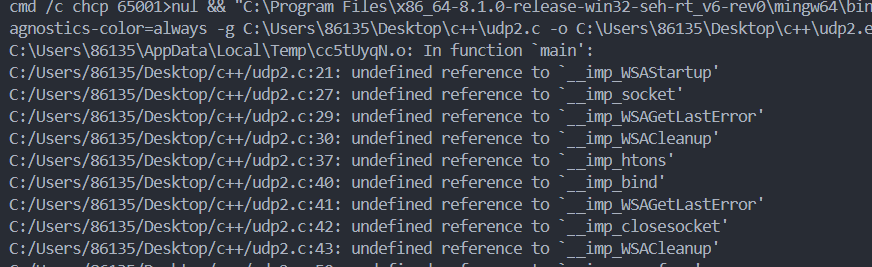
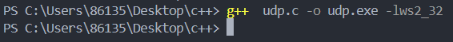
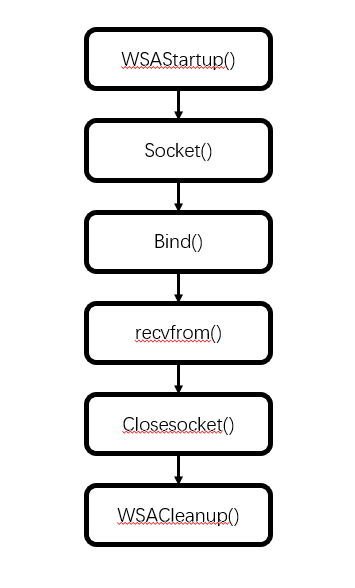
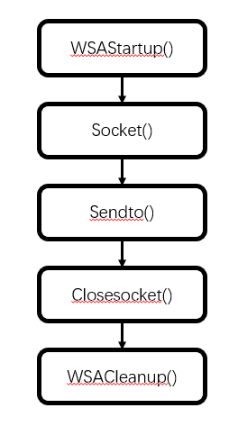

### (1)

在编程时，编译不通过，报错：



随后通过查阅资料发现，这是因为链接器无法找到Winsock库中的必要函数，因此在编译命令后面加入-lws2_32，告诉链接器链接到到名为 `ws2_32`的库，解决问题：



在最初编程时，接收端总是接收不到消息，在查找相关资料后发现，是在将ip以及端口号写入sockaddr_in数据结构时没能注意到网络传输时的存储方式（大端存储）与主机存储方式（一般是小端存储）的不同，导致一直发送不到正确的主机上，造成数据接收失败。

随后我们使用htons和inet_addr函数来成功解决这一问题。

### (2)

udp接收端代码如下：

```c
#include <stdio.h>  
#include <stdlib.h>  
#include <string.h>  
#include <winsock2.h>  
  
#define PORT 12345  
#define PACKET_SIZE 100  
#define BUFFER_SIZE 512  
#define PACKET_COUNT 100
  
int main() {  
    WSADATA wsaData;  
    SOCKET recvSocket;  
    struct sockaddr_in localAddr, clientAddr;  
    int clientAddrLen = sizeof(clientAddr);  
    char buffer[BUFFER_SIZE];  
    int receivedPackets = 0;  

  
    // 初始化Winsock库  
    if (WSAStartup(MAKEWORD(2, 2), &wsaData) != 0) {  
        fprintf(stderr, "WSAStartup failed\n");  
        return 1;  
    }  
  

    recvSocket = socket(AF_INET, SOCK_DGRAM, IPPROTO_UDP);  
    if (recvSocket == INVALID_SOCKET) {  
        fprintf(stderr, "socket failed: %ld\n", WSAGetLastError());  
        WSACleanup();  
        return 1;  
    }  
  

    memset(&localAddr, 0, sizeof(localAddr));  
    localAddr.sin_family = AF_INET;  
    localAddr.sin_port = htons(PORT);  
    localAddr.sin_addr.s_addr = inet_addr("172.16.4.3"));  
  
    if (bind(recvSocket, (struct sockaddr*)&localAddr, sizeof(localAddr)) == SOCKET_ERROR) {  
        fprintf(stderr, "bind failed: %ld\n", WSAGetLastError());  
        closesocket(recvSocket);  
        WSACleanup();  
        return 1;  
    }  
  

    int c = 0;
    while (c < PACKET_COUNT) {  
        int bytesReceived = recvfrom(recvSocket, buffer, BUFFER_SIZE - 1, 0, (struct sockaddr*)&clientAddr, &clientAddrLen);  
        if (bytesReceived > 0) {  
            buffer[bytesReceived] = '\0';  
   
            if (clientAddr.sin_addr.s_addr == inet_addr("172.26.46.52")) {  
                printf("Received: %s\n", buffer);   
                receivedPackets++;  
            } else {  
                printf("not expect packet\n");  
            }  
        } else {  
            fprintf(stderr, "recvfrom failed: %ld\n", WSAGetLastError());  
            break;  
        }  
        c++;
    }  
  

    int lostPackets = PACKET_COUNT - receivedPackets;  
  
  
    printf("Total packets sent: %d\n", PACKET_COUNT);  
    printf("Total packets received: %d\n", receivedPackets);  
    printf("Total packets lost: %d\n", lostPackets);  
  

    closesocket(recvSocket);  
    WSACleanup();  
    while(1) {

    }
    return 0;  
}
```

接收端（服务端）程序详细流程图如下：



首先使用WSAStartup(MAKEWORD(2, 2), &wsaData)初始化WSA库，接着使用socket(AF_INET, SOCK_DGRAM, IPPROTO_UDP)创建UDP套接字，使用Bind()绑定本地ip。

设置循环，该循环只有在收到一百个数据报后才会退出（不管收到的数据报是不是发送端发的，接收到100个就退出循环）。在每次循环时，使用recvfrom()函数接收数据报，此函数会将接收到的数据报放入缓冲中buffer（每次都是从初始位置放，意味着每次接收新的数据报后，buffer就会被覆盖，不存储之前的内容），并且将发送端的ip地址和端口号等信息写入chlientAddr中。

读取chlientAddr中的地址，判断是不是预想中的发送方地址（这里理想的认为发送方ip不会再有其他端口与该套接字通过udp通信），若是，计数器加1。

100次循环结束后，统计丢包率等信息，关闭套接字，释放所使用的Windows Sockets DLL。

发送端代码设计如下：

```c
#include <stdio.h>  
#include <stdlib.h>  
#include <string.h>  
#include <winsock2.h>  
  
#define PORT 12345  
#define SERVER_IP "172.16.4.3" // 接收端的IP地址  
#define PACKET_COUNT 100
#define PACKET_SIZE 100
  
int main() {  
    WSADATA wsaData;  
    SOCKET sendSocket;  
    struct sockaddr_in serverAddr;  
    char packet[PACKET_SIZE];  
    int i;  
  
    // 初始化Winsock库  
    if (WSAStartup(MAKEWORD(2, 2), &wsaData) != 0) {  
        fprintf(stderr, "WSAStartup failed\n");  
        return 1;  
    }  
  
    // 创建发送套接字  
    sendSocket = socket(AF_INET, SOCK_DGRAM, IPPROTO_UDP);  
    if (sendSocket == INVALID_SOCKET) {  
        fprintf(stderr, "socket failed: %ld\n", WSAGetLastError());  
        WSACleanup();  
        return 1;  
    }  
  
    // 设置接收端地址和端口  
    memset(&serverAddr, 0, sizeof(serverAddr));  
    serverAddr.sin_family = AF_INET;  
    serverAddr.sin_port = htons(PORT);  
    serverAddr.sin_addr.s_addr = inet_addr(SERVER_IP);  
  
    // 发送数据包  
    for (i = 0; i < PACKET_COUNT; i++) {  
        sprintf(packet, "Packet %d", i + 1);  
        if (sendto(sendSocket, packet, strlen(packet), 0, (struct sockaddr*)&serverAddr, sizeof(serverAddr)) == SOCKET_ERROR) {  
            fprintf(stderr, "sendto failed: %ld\n", WSAGetLastError());  
            closesocket(sendSocket);  
            WSACleanup();  
            return 1;  
        }  
        printf("Sent: %s\n", packet);  
    }  
  
    // 关闭套接字和清理Winsock库  
    closesocket(sendSocket);  
    WSACleanup();  
    while(1) {

    }
    return 0;  
}
```



发送端代码十分简单，首先使用WSAStartup(MAKEWORD(2, 2), &wsaData)初始化WSA库，接着使用socket(AF_INET, SOCK_DGRAM, IPPROTO_UDP)创建UDP套接字，设置好接收端的ip和端口号，在100次循环中使用sendto()发送指定的数据报即可。最后关闭套接字，释放所使用的Windows Sockets DLL。

### (3)

使用Socket API时，客户端与服务端都有可能共同使用的函数，如Send()和Recv(),Socket()，WSAStartup()，WSACleanup()等。

但它们还有一些函数是不同的，如服务端使用的bind()函数，用来将本地ip和端口绑定到套接字上，若为TCP连接，则还需要listen()函数请求TCP进程监听套接字设置的端口，建立连接请求队列。accept()函数来获得客户端请求。

对于客户端，若是TCP连接，客户端需要通过connect函数发出连接请求。

### (4)

struct sockaddr * addr 用来存储ip和端口，其中包含两个部分，sa_family用于保存地址族，用于指定地址类型，如AF_INET（IPv4）、AF_INET6（IPv6）等。

sa_data 用于存储与套接字相关的地址数据，包含地址和端口信息。一般我们使用struct sockaddr_in来存储，在上传参数时通过类型转换将sockaddr_in *转换成struct sockaddr *类型进行参数传递。

struct sockaddr  中的sa_data是一个14字节的数据结构，则一共可用112位，前16位用来表示端口号，中间32位用来表示IP地址，后64位不使用。比如，若sa_data如下：

0x0050ac100403(网络传输中采用大端存储，而一般主机采用小端存储)前16位表示端口号，因为是大端存储，所以端口号是80，后面的0xac100403表示ip地址，是172.16.4.3。
