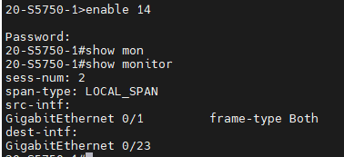
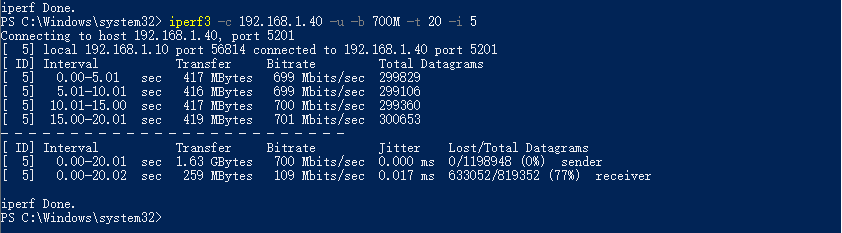
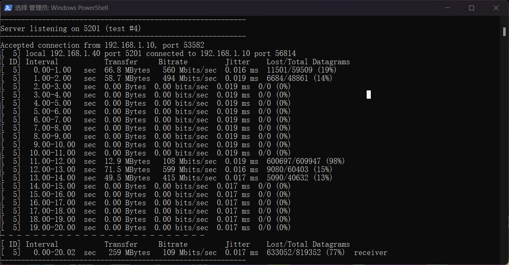
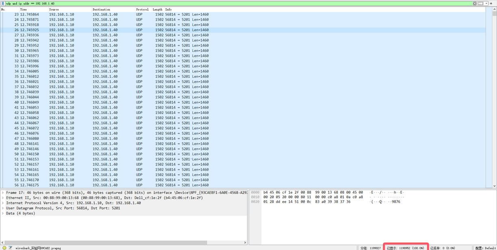
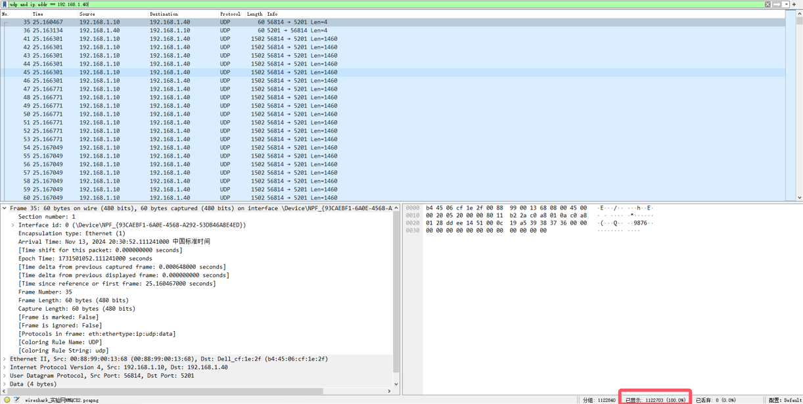
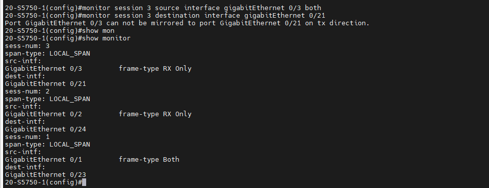
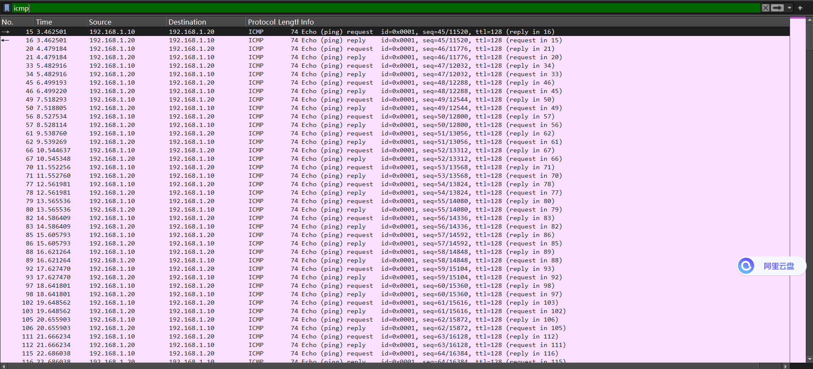
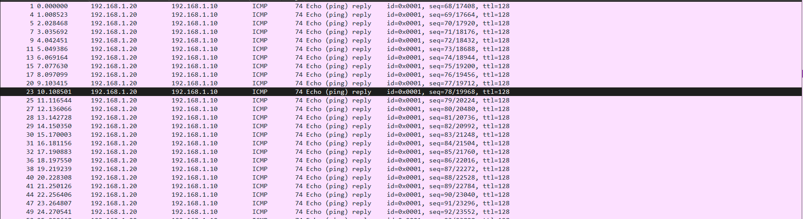

（2）思路是为发送方的端口配置镜像端口，然后使用ipcerf来控制两个主机间以高通信速率进行通信，对比发送方与镜像端口的包的数量来验证是否有丢包现象产生。

配置镜像端口信息如下，发送方ip地址为192.168.1.10，连接端口0/1，另一台主机192.168.1.30连接端口0/23，来抓取镜像包，接收方地址为192.168.1.40，主机192.168.1.10和192.168.1.30都开启wireshark抓包：

使用iperf控制两个主机间的通信速率为700M，通信时长20s，采用UDP进行通信。

发送方：

接收方：

在通信结束后，查看抓包：

发送端抓包：

镜像端口抓包：

对比右下角的包数可以发现，镜像端口的抓包数明显少了70000，说明在两个主机高速率通信下，镜像端口会出现丢包现象。

（4）可以设置两个镜像端口，分别对通信主机A与主机B的端口进行镜像，然后通过另外两个主机连接镜像端口连接主机进行分别抓包采集。为实现这一设想，配置信息如下：

其中一个会话没有用到，主机A（192.168.1.10）连接端口0/1，主机B（192.168.1.20）连接端口0/3。分别两个主机连接端口0/21，端口0/23来采集数据。

主机Aping主机B，在两个监测主机即可抓包ping相关数据包，如下：

主机A的镜像端口采集的发送与接收的ICMP数据包

主机B测发出的恢复数据包：

通过上述实验，验证了采用不同镜像端口分别对主机A和主机B进行数据采集的构想。
