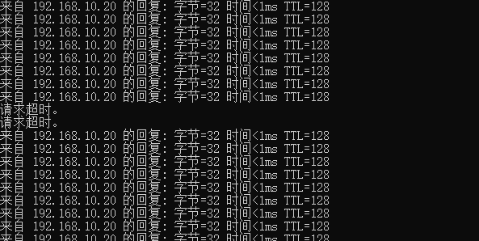
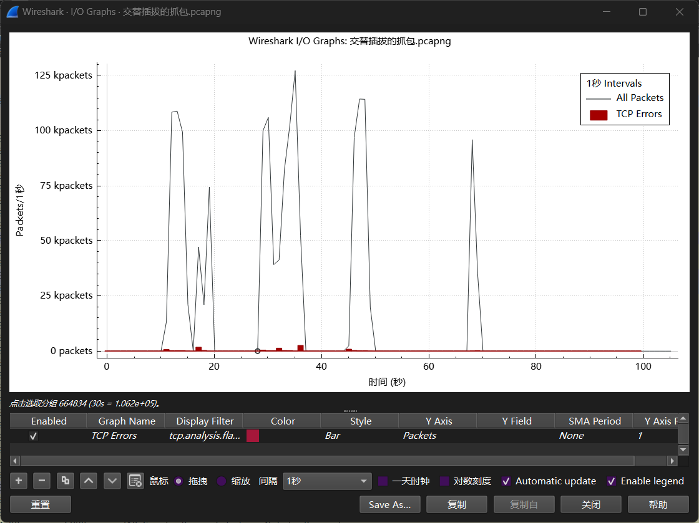
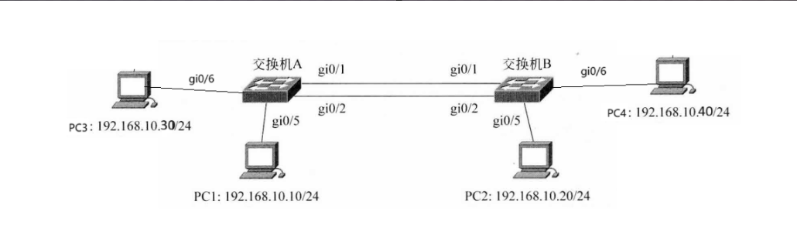
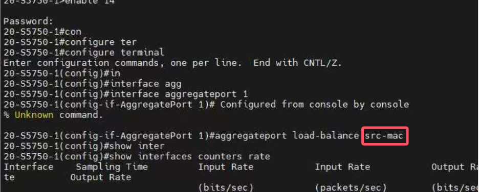
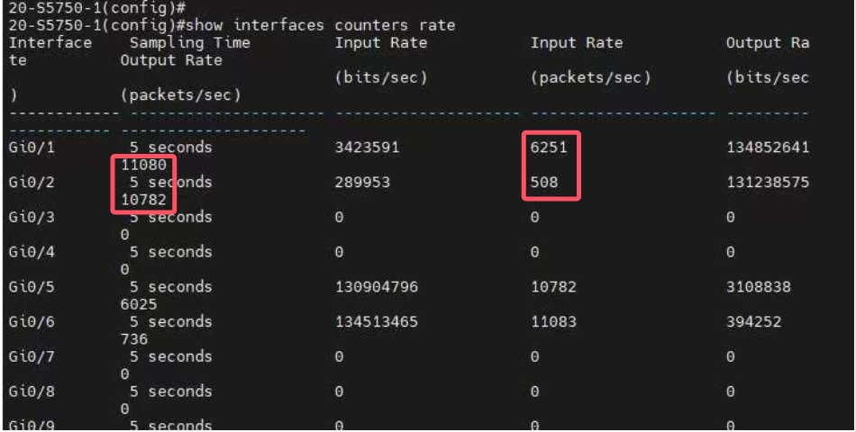

（3）在两台主机之间使用ping命令进行通信，期间拔掉正在使用的链路（期间使用速率检测命令判断哪条链路正在使用），会发现中途会丢掉部分包，但之后通信恢复正常。说明链路聚合的动态备份有效。对于拔线过程中存在丢包现象，推测是交换机进行转换需要一定的时间开销导致的。

（4）重做步骤5，发现依旧没有增大带宽，原因是在实验所示环境下，仅有两个主机的通信无法体现负载均衡的模式，总会有一条链路处于备份状态。

在此状态下进行数据传送，交替插拔1，2端口网线（当时正在工作的网线），会发现每次插拔都会引起传输速率的变化，具体来说，当拔掉正在工作的网线时，会发现速率迅速下降，然后又回升上来。下图传输时的文件传输速率图很好的反映了这一点：

以下是抓包的统计图，可以看到与上面的分析是一致的：

在传输完成后检查文件大小，发现文件大小与原文件大小一致，说明传输过程中并未发生文件丢失。

在上述实验中，我们可以看到聚合链路动态备份可以有效的保证链路传输的可靠性，当其中一条链路发生故障时，备份链路可以被启动承担传输任务。但由于切换链路的时间开销，会导致链路传输平均速率减慢。

#### 实验思考：

（1）在原先网络拓扑结构的基础上将PC3和PC4加入网络，构建网络拓扑如下图所示：

对交换机进行配置后，设置负载均衡模式为src-mac，这种模式会根据数据帧的源MAC地址来选择链路：

然后让PC1与PC2、PC3与PC4两个主机跨交换机同时分别发送数据，并在命令行使用命令查看端口速率，发现1，2个端口输出速率都不为0，且输出速率大体一致（文件传输进度图显示的传输速率都为百兆），说明两个端口都在同时工作，聚合端口处于流量平衡模式：

