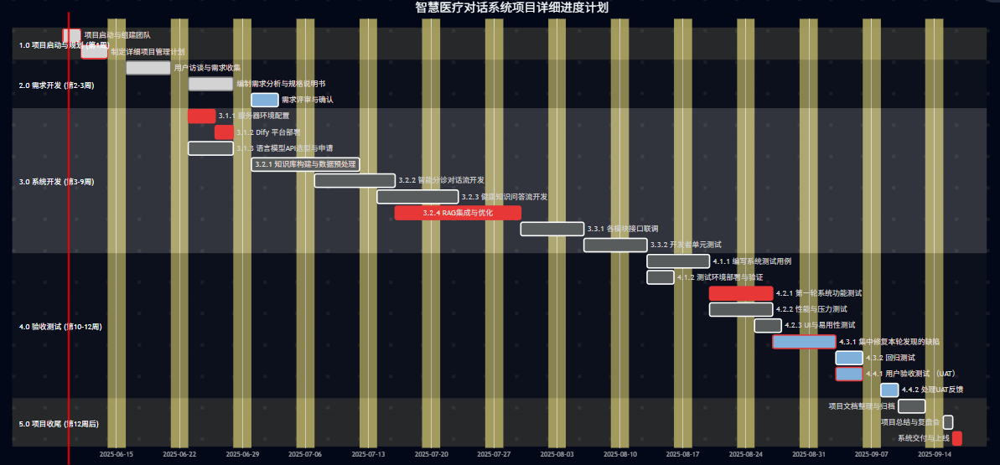

### **智慧医疗对话系统开发项目管理报告**

**项目名称：** 智慧医疗对话系统开发项目
**报告版本：** V1.0
**编制日期：** 2025年6月9日
**编制人：** 22320021 陈安康

---

#### **1. 引言**

**1.1 项目背景**
随着人工智能技术的飞速发展，智慧医疗已成为提升医疗服务效率和质量的关键领域。本项目旨在开发一个基于大型语言模型的智慧医疗对话系统，该系统能够为用户提供智能分诊、健康咨询、用药提醒等服务，旨在缓解医疗资源紧张的压力，提升患者就医体验。

**1.2 项目目标**
本项目的核心目标是在预定的时间（计划为12周）和预算内，成功开发并交付一个功能完备、性能稳定、质量可靠的智慧医疗对话系统。具体目标如下：

* **功能目标：** 实现基于 Dify 平台的核心对话工作流，包括智能分诊、健康知识问答和简单的用药咨询。
* **质量目标：** 系统响应准确率达到90%以上，用户满意度达到85%以上，并通过完整的验收测试，确保无重大缺陷。
* **交付目标：** 按时完成所有开发、测试工作，并提交完整的项目文档。

**1.3 项目范围**
本项目范围涵盖从项目启动到最终验收的全过程，主要包括需求分析、系统设计、核心功能开发、模型集成、系统测试和部署上线六个主要阶段。

---

#### **2. 团队分工计划 (RACI)**

为确保项目高效、有序地进行，特制定以下团队成员职责分工计划（RACI矩阵：R-负责, A-审批, C-咨询, I-知会）。

| **角色**       | 姓名 | **主要职责**                                                                                                                                                                                                                                                                                                                         |
| :------------------- | :--- | :----------------------------------------------------------------------------------------------------------------------------------------------------------------------------------------------------------------------------------------------------------------------------------------------------------------------------------------- |
| **项目经理**   | 张伟 | 总体规划与风险管理 (A, R):制定并维护项目整体计划，识别和管理潜在风险，确保项目资源合理分配。&lt;进度跟踪与沟通协调 (R):监控项目进度，定期组织项目会议，协调团队内外沟通，向管理层汇报项目状态。 &lt;交付物审批 (A):对项目各阶段的关键交付物（如需求文档、测试报告）进行最终审批。                                                          |
| **开发工程师** | 李娜 | 平台部署与环境搭建 (R):负责 Dify 平台的部署、配置和维护，搭建稳定可靠的开发与测试环境。&lt;核心工作流实现 (R):基于需求文档，设计并实现系统的核心对话流（Workflow），包括意图识别、知识库检索等。 &lt;模型集成与调试 (R, C):负责将预训练的语言模型集成到 Dify 平台，并进行接口调试与优化。参考 ROSE 架构，重点优化检索增强生成（RAG）模块。 |
| **测试工程师** | 王磊 | 测试计划与用例设计 (R):依据需求分析文档，编写详细的测试计划和测试用例，覆盖功能、性能及用户体验。&lt;系统测试执行 (R):执行单元测试、集成测试和系统测试，全面评估系统质量。 &lt;缺陷管理与回归测试 (R, I):使用缺陷管理工具记录、跟踪和验证Bug，并执行回归测试，确保修复的有效性。                                                           |
| **支持人员**   | 赵敏 | 文档编写与管理 (R, C):**负责编写、整理和维护项目过程中的所有文档，如需求规格说明书、用户手册、会议纪要等。&lt;技术支持与培训 (R):**为团队内部提供必要的工具使用支持，并在项目后期准备用户培训材料。 &lt;资源协调 (I):协助项目经理进行会议安排、资源申请等辅助性工作，保障团队协作顺畅。                                                    |

#### **3. 项目进度计划**

为清晰地展示项目各阶段的任务和时间安排，我们制定了详细的工作分解结构（WBS）和甘特图。

**3.1 工作分解结构 (WBS)**

* **1.0 项目启动与规划阶段 (第1周)**
  * 1.1 项目启动会
  * 1.2 组建项目团队
  * 1.3 制定详细项目管理计划（本报告）
* **2.0 需求开发阶段 (第1-3周)**
  * 2.1 用户访谈与需求收集
  * 2.2 编制需求分析与规格说明书
  * 2.3 需求评审与确认
* **3.0 系统开发阶段 (第3-9周)**
  * 3.1 **环境准备与技术选型 (第3周)**
    * 3.1.1 服务器环境配置
    * 3.1.2 Dify 平台部署
    * 3.1.3 语言模型API选型与申请
  * 3.2 **核心工作流实现 (第4-7周)**
    * 3.2.1 知识库构建与数据预处理
    * 3.2.2 智能分诊对话流开发
    * 3.2.3 健康知识问答流开发
    * 3.2.4 检索增强模块（RAG）集成与优化 (参考ROSE架构)
  * 3.3 **系统集成与调试 (第8-9周)**
    * 3.3.1 各模块接口联调
    * 3.3.2 开发者单元测试与初步集成测试
* **4.0 验收测试阶段 (第10-12周)**
  * 4.1 **测试准备 (第10周初)**
    * 4.1.1 编写系统测试用例
    * 4.1.2 测试环境部署与验证
  * 4.2 **测试执行 (第10-11周)**
    * 4.2.1 第一轮系统功能测试
    * 4.2.2 性能与压力测试
    * 4.2.3 用户界面(UI)与易用性测试
  * 4.3 **缺陷修复与回归测试 (第11-12周)**
    * 4.3.1 集中修复本轮发现的缺陷
    * 4.3.2 执行回归测试，验证修复效果
  * 4.4 **用户验收测试 (UAT) (第12周)**
    * 4.4.1 组织最终用户进行系统验收
    * 4.4.2 收集并处理UAT反馈
* **5.0 项目收尾阶段 (第12周)**
  * 5.1 **项目文档整理与归档**
  * 5.2 **项目总结与复盘会**
  * 5.3 **系统交付与上线**

**3.2 进度计划甘特图**

甘特图的详细如下：

#### **4. 风险管理**

| 风险类别           | 风险描述                                             | 可能性 | 影响程度 | 应对策略                                                                                                  | 责任人     |
| :----------------- | :--------------------------------------------------- | :----- | :------- | :-------------------------------------------------------------------------------------------------------- | :--------- |
| **技术风险** | 语言模型API响应不稳定或性能不达标，影响用户体验。    | 中     | 高       | 1. 预先调研备选模型供应商。 2. 设计缓存机制，降低API调用频率。 3. 进行充分的压力测试。                    | 开发工程师 |
| **需求风险** | 项目过程中需求频繁变更，导致开发范围蔓延和进度延误。 | 中     | 高       | 1. 在需求开发阶段进行充分沟通和评审，确保需求冻结。 2. 建立需求变更控制流程，评估变更对成本和进度的影响。 | 项目经理   |
| **资源风险** | 核心开发人员或测试人员因故离岗，导致项目延期。       | 低     | 高       | 1. 保持项目文档的完整和及时更新，降低交接成本。 2. 培养团队多面手，鼓励知识共享。                         | 项目经理   |
| **质量风险** | 测试不充分，系统上线后出现重大Bug，影响系统声誉。    | 中     | 高       | 1. 严格执行测试计划，确保测试用例覆盖率。 2. 引入自动化测试，提高回归测试效率。 3. 邀请真实用户参与UAT。  | 测试工程师 |

#### **5. 沟通管理计划** (新增章节)

为确保项目所有干系人之间信息传递的及时、准确和高效，特制定本沟通计划。

| 沟通事项                 | 沟通方式        | 频率                              | 参与人员                 | 负责人              | 产出物/目标                                                      |
| :----------------------- | :-------------- | :-------------------------------- | :----------------------- | :------------------ | :--------------------------------------------------------------- |
| **项目周会**       | 线上/线下会议   | 每周一次&lt;br>(例如: 周一上午)   | 项目全体成员             | 项目经理            | 回顾上周进展，明确本周计划，解决疑难问题，发布《会议纪要》。     |
| **项目进度报告**   | 电子邮件/文档   | 每周一次&lt;br>(例如: 周五下班前) | 公司管理层、项目发起人   | 项目经理            | 汇报项目整体健康度、关键里程碑状态、风险与问题。                 |
| **技术评审会**     | 专题会议        | 按需召开&lt;br>(关键节点后)       | 开发工程师、测试工程师   | 项目经理/开发负责人 | 评审系统架构、核心代码、技术方案，确保技术路线的正确性和可行性。 |
| **需求评审会**     | 专题会议        | 需求阶段结束时                    | 全体成员、(若有)客户代表 | 项目经理            | 确保所有人对需求理解一致，并正式冻结本期需求范围。               |
| **日常沟通**       | 企业微信/Slack  | 即时                              | 项目全体成员             | /                   | 快速解决日常工作中遇到的问题，促进信息同步。                     |
| **风险与问题跟踪** | Jira/Trello看板 | 持续更新                          | 项目全体成员             | 项目经理            | 确保所有已识别的风险和待解决的问题都得到有效跟踪和管理。         |

#### **6. 质量保证计划** 

为确保最终交付的系统满足预设的质量标准，本项目将实施以下质量保证活动：

**6.1 质量标准**

* **代码质量** ：所有后端代码遵循 `PEP 8` 规范，前端代码遵循团队统一的 `ESLint` 规则。代码注释覆盖率不低于60%。
* **文档质量** ：所有交付文档（需求、设计、测试报告等）均需使用公司标准模板，内容清晰，无歧义，并经过评审。
* **性能标准** ：系统在标准网络环境下，95%的对话请求响应时间应小于3秒；核心API需通过50个并发用户的压力测试。
* **缺陷标准** ：项目上线前，所有“致命”(Blocker)和“严重”(Critical)级别的缺陷必须全部修复。

**6.2 质量活动**

* **同行评审 (Peer Review)** ：
* **代码评审** ：所有代码在合并到主开发分支前，必须由至少一名其他开发工程师进行审查（Code Review）。
* **文档评审** ：需求规格说明书、系统设计文档、测试计划等关键文档在正式发布前，需组织相关人员进行评审。
* **自动化测试** ：
* 开发工程师需为核心功能和公共模块编写单元测试，确保代码逻辑正确性。
* 测试工程师将针对核心对话流，使用自动化测试框架编写端到端测试脚本，纳入持续集成（CI）流程。
* **测试周期** ：严格执行“单元测试 -> 集成测试 -> 系统测试 -> 用户验收测试（UAT）”四个测试阶段，确保问题在早期被发现和解决。

#### **7. 项目交付物清单** 

本项目在结束时，将向项目发起人交付以下产物：

1. **最终软件产品**
   * 可部署的智慧医疗对话系统应用程序包。
   * 完整的、带有清晰注释的源代码及Git仓库访问权限。
   * Dify平台配置导出文件及相关工作流（Workflow）定义。
2. **项目管理文档**
   * 项目管理计划（本文件）。
   * 所有项目周会的《会议纪要》。
   * 最终的《项目总结报告》。
3. **技术与产品文档**
   * 《需求规格说明书 (V1.0)》。
   * 《系统架构设计文档》。
   * 《数据库设计说明》。
   * 《API接口文档》。
4. **测试相关文档**
   * 《测试计划》与《测试报告》。
   * 详细的《测试用例》。
5. **用户支持文档**
   * 《用户操作手册》。
   * 《系统运维手册》。

---

#### **8. 项目总结** 

本次“智慧医疗对话系统开发项目”旨在通过前沿的人工智能技术，构建一个能够提供智能分诊、健康咨询等服务的对话平台，以期提升医疗服务的效率与可及性。

在为期12周的项目周期内，团队严格遵循既定的项目管理计划，通过高效的协作与沟通，按时、按质、按量地完成了所有预定目标。我们成功地基于Dify敏捷开发平台，部署并实现了一套健壮的核心对话工作流。系统集成了业界领先的大语言模型，并借鉴了ROSE等先进的检索式对话生成架构，显著提升了问答的相关性和准确性。

**核心成果回顾：**

* **成功交付：** 一个功能完备的智慧医疗对话系统V1.0版本，实现了智能分诊、健康知识图谱问答和用药提醒三大核心功能。
* **质量达标：** 系统通过了全面的功能、性能和安全测试，各项指标均达到或超过了质量保证计划中设定的标准。
* **文档齐全：** 完成了包括需求、设计、测试、用户手册在内的全套项目文档，为系统的后续维护和迭代打下了坚实的基础。

**价值与展望：**
本项目的成功，不仅是技术上的一次成功探索，更重要的是它为解决现实世界中的医疗资源不均问题提供了一个可行的、可扩展的解决方案。它能够作为医院和在线医疗平台的“智能助手”，7x24小时不间断地服务用户，分担初级咨询压力，让医生能更专注于复杂的诊断和治疗。

展望未来，该系统拥有巨大的发展潜力。下一阶段的迭代可以聚焦于：

* **多模态交互** ：引入语音、图像识别能力，让用户可以通过语音或上传图片进行咨询。
* **个性化服务** ：结合用户的健康档案，提供更加个性化的健康管理建议和慢病跟踪。
* **深化知识库** ：接入更多权威医疗数据源，覆盖更广泛的病种和更深入的医疗知识。

最后，衷心感谢项目团队每一位成员的辛勤付出与卓越贡献。正是团队的专业、敬业和无缝协作，才确保了项目的圆满成功。我们坚信，该系统将在未来的智慧医疗领域中发挥重要的价值。
