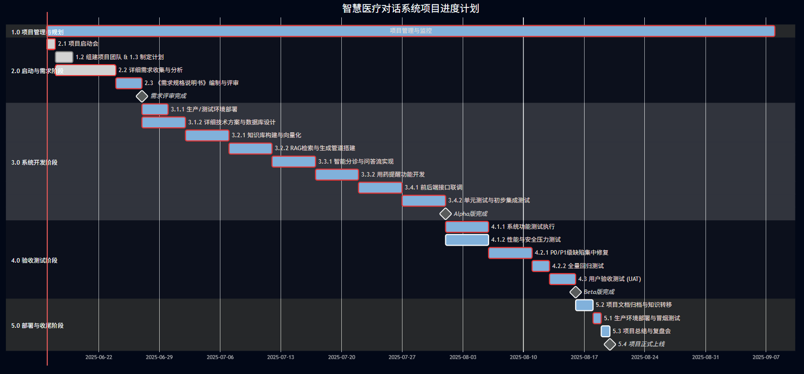

### **智慧医疗对话系统开发项目管理计划 (PMP)**

**项目代号：** Phoenix-MedBot

**文档编号：** PMP-PMB-2025-V2.0

**版本：** 2.0 (正式版)

**编制日期：** 2025年6月16日

**编制人：** 22320021 陈安康 (项目经理)

#### **文档修订历史**

| 版本 | 修订日期   | 修订内容                                                           | 修订人 |
| :--- | :--------- | :----------------------------------------------------------------- | :----- |
| V1.0 | 2025-06-09 | 初稿创建                                                           | 陈安康 |
| V2.0 | 2025-06-16 | 根据评审意见全面增强，新增预算、变更管理等模块，补完并细化所有章节 | 陈安康 |

**1.0 项目执行摘要**

本项目旨在开发并部署“Phoenix-MedBot”——一个基于Dify平台和大型语言模型（LLM）的智慧医疗对话系统。项目是公司“AI+大健康”战略的关键一步，旨在通过技术创新，为公众提供7x24小时的初步健康咨询与智能分诊服务，以抢占线上轻医疗服务入口，并探索AI驱动的订阅制服务模式。

项目总周期预计为  **12周** ，总预算为  **¥[XXX,XXX]** 。计划交付一个功能完备的MVP（最小可行产品），其核心目标是实现  **NPS（净推荐值）达到+20** ，并在 **50个并发用户** 的压力下，确保  **95%的请求响应时间低于2秒** 。

本项目由技术部总监 **刘总** 发起，由项目经理 **陈安康** 全权负责执行。项目成功交付将为公司带来显著的品牌价值提升，并为后续商业化迭代验证技术路径与市场接受度，预期在上线后6个月内积累超过1万名注册用户。本报告将作为项目全生命周期的核心指导文件。

#### **2.0 引言**

**2.1 项目背景与业务驱动力**
当前，公众对即时、便捷的医疗健康信息的需求日益增长，而传统医疗资源则面临着分布不均和服务时间有限的挑战。本项目正是在此背景下提出，其核心业务驱动力在于：

1. **市场机遇：** 填补夜间、节假日等非工作时间的轻量级医疗咨询空白。
2. **效率提升：** 通过AI自动回答常见健康问题，将线下医疗资源释放给更需要的重症患者。
3. **品牌创新：** 树立公司在智慧医疗领域的领先技术形象，增强用户粘性。

**2.2 项目目标与成功标准 (SMART原则)**
本项目的成功将通过以下具体、可衡量的标准来评判：

* **范围目标 (Specific):** 成功上线一个包含三大核心功能的MVP：①基于RAG的智能分诊、②权威知识库问答、③可配置的用药提醒。
* **质量目标 (Measurable):**
  * **准确性:** 针对预设的100个覆盖多种病症的测试用例，由内部医学顾问盲测，系统回答的医学准确率不低于90%。
  * **性能:** 在模拟50个并发用户的压力测试下，系统95百分位的请求响应时间必须小于2秒。
  * **满意度:** 系统上线后第二周，通过应用内NPS调研，用户净推荐值达到+20以上。
* **交付目标 (Achievable & Relevant):**
  * 在12周内完成所有开发、测试工作，并交付本报告10.0章节中定义的所有产物。
  * 项目总支出不超过预算的105%。
* **时间目标 (Time-bound):** 项目必须在 **2025年9月5日** 前完成生产环境部署并正式对公众开放。

**2.3 项目范围**

* **2.3.1 范围内 (In Scope):**
  * 基于Dify平台的私有化部署与高可用配置。
  * 整合与处理至少三种权威医疗数据源，构建项目专用知识库。
  * 实现以ROSE架构为指导的、基于检索增强生成（RAG）的核心对话工作流。
  * 集成并精调（Prompt Engineering）至少一个主流大语言模型。
  * 覆盖功能、性能、安全、UI/UX和医疗准确性的全面测试。
  * 编制完整的项目技术文档、管理文档与用户支持文档。
* **2.3.2 范围外 (Out of Scope):**
  * 任何硬件设备的采购与管理。
  * 与医院HIS/EMR等系统的实时数据对接。
  * 提供具有法律效力的电子处方或在线诊疗。
  * 自主研发或训练基础大语言模型。
* **2.3.3 关键假设与约束**
  * **假设:**
    * 所选的第三方LLM API能够提供持续稳定的服务。
    * 项目期间，核心团队成员将保持稳定。
    * 获取的医疗数据在版权和使用上没有法律障碍。
  * **约束:**
    * 项目总预算不得超过  **¥[XXX,XXX]** 。
    * 项目必须在 **2025年9月5日** 前上线。
    * 系统开发必须遵循公司现行的信息安全与数据隐私政策。

#### **3.0 项目治理与团队**

**3.1 项目干系人分析**

| 姓名   | 角色       | 期望与诉求                   | 影响/利益 | 参与度 | 沟通策略                   |
| :----- | :--------- | :--------------------------- | :-------- | :----- | :------------------------- |
| 刘总   | 项目发起人 | 项目成功，符合战略，控制成本 | 高/高     | 低     | 每周进度报告，里程碑评审会 |
| 陈安康 | 项目经理   | 按时、按质、按预算完成项目   | 高/高     | 高     | 日常管理，主持所有会议     |
| 李娜   | 开发工程师 | 技术方案可行，代码质量高     | 中/中     | 高     | 每日站会，技术评审         |
| 王磊   | 测试工程师 | 充分测试，保障产品质量       | 中/中     | 高     | 每日站会，测试评审         |
| 赵敏   | 支持人员   | 流程清晰，文档规范           | 低/中     | 中     | 周会，按需沟通             |
| 财务部 | 支持部门   | 预算合规，报销及时           | 低/中     | 低     | 按需通过邮件/OA流程沟通    |
| 法务部 | 支持部门   | 数据合规，无版权风险         | 中/中     | 低     | 项目初期咨询，上线前审核   |

**3.2 团队分工 (RACI矩阵)**

| 角色                 | 姓名   | 主要职责 (具体、可操作)                                                                                                                                                                                                                                                                                                              |
| :------------------- | :----- | :----------------------------------------------------------------------------------------------------------------------------------------------------------------------------------------------------------------------------------------------------------------------------------------------------------------------------------- |
| **项目经理**   | 陈安康 | 总体规划与风险管理 (A, R):制定并动态维护本PMP；使用Jira持续跟踪风险，并推动缓解措施的执行。&lt;进度与成本控制 (R):每周通过Jira燃尽图和工时统计，监控并报告项目进度与成本偏差。&lt;沟通协调 (R):主持项目例会，协调跨团队依赖，作为项目对外的唯一沟通接口。&lt;交付物审批 (A):对需求文档、测试报告、上线申请等关键交付物进行最终审批。 |
| **开发工程师** | 李娜   | 平台部署与架构设计 (R):负责Dify平台在K8s集群上的部署与高可用配置；主导系统技术架构设计。&lt;核心工作流实现 (R, C):基于ROSE思想，设计并实现RAG对话流；编写核心业务逻辑的Python代码。&lt;模型集成与调优 (R):集成LLM API，通过Prompt工程和Few-shot learning优化模型表现，确保关键API调用P95延迟&lt;500ms。                              |
| **测试工程师** | 王磊   | 测试策略与用例设计 (R):设计覆盖度不低于95%的功能测试用令；编写自动化性能测试脚本（JMeter）。&lt;测试执行与缺陷管理 (R):执行所有测试周期；在Jira中精确记录、跟踪和验证Bug，确保P0/P1级Bug清零方可上线。&lt;质量看护 (R, I):参与代码评审，对系统可测性提出要求；向团队知会质量风险。                                                   |
| **支持人员**   | 赵敏   | 文档编写与知识库管理 (R, C):负责在Confluence上编写、整理所有非技术类文档；协助李娜进行医疗知识库的数据清洗与标注。&lt;会议与资源协调 (R):负责所有项目会议的组织、纪要编写与分发；协助项目经理进行资源申请和团队建设活动。                                                                                                            |

#### **4.0 项目执行计划**

**4.1 工作分解结构 (WBS)**

**项目总周期：** 12周
**起始日期：** 2025年6月16日 (周一)
**预计结束日期：** 2025年9月5日 (周五)

* **第一、二阶段：启动与需求 (第1-2周：6/16 - 6/27)**
  * 前两天完成项目启动（1.1）和团队组建（1.2），并立即开始需求收集（2.1）和项目计划的细化（1.3）。
  * 利用剩余时间完成需求分析，并在第二周结束前编制并评审通过《需求规格说明书》（2.2, 2.3），这是后续所有工作的基石。
* **第三阶段：系统开发 (第3-9周：6/30 - 8/22)**
  * **技术准备 (第3周)：** 在需求确认后，立即用一周时间并行完成服务器环境配置（3.1.1）和技术方案与数据库设计（3.1.2）。
  * **冲刺一 (第4-5周)：** 用两周时间开发核心数据引擎。首先用一周构建知识库并进行向量化（3.2.1），再用一周搭建RAG检索与生成管道（3.2.2）。
  * **冲刺二 (第6-7周)：** 用两周时间完善核心对话功能。分别用一周时间开发智能分诊问答流（3.3.1）和用药提醒功能（3.3.2）。
  * **冲刺三 (第8-9周)：** 最后两周进行集成与收尾。用一周时间进行前后端接口联调（3.4.1），再用一周进行开发者内部的单元与初步集成测试（3.4.2），并在第9周结束时交付Alpha版。
* **第四阶段：测试与验收 (第10-12周：8/25 - 9/5)**
  * **全面测试 (第10周)：** 用一整周时间进行集中测试。系统功能测试（4.1.1）和性能与安全测试（4.1.2）将在此期间并行展开，以尽快暴露问题。
  * **集中修复 (第11周)：** 用一整周时间，开发团队全力修复在第10周发现的P0/P1级缺陷（4.2.1），并由测试团队在后半周进行全量回归测试（4.2.2），确保修复质量。
  * **用户验收 (第12周初)：** 在第12周的前三天，组织最终用户进行UAT（4.3），获取最真实的使用反馈。Beta版里程碑在此完成。
* **第五阶段：部署与收尾 (第12周：9月3日后)**
  * UAT完成后，立即开始生产环境的部署与冒烟测试（5.1）。
  * 并行进行项目文档的最终整理与归档（5.2）。
  * 在上线前一天，召开项目总结复盘会（5.3），最后完成系统上线（5.4）。所有工作在第12周内收尾。

**4.2 项目进度计划** 

#### **5.0 预算与资源计划**

**5.1 高阶预算分解**

| 成本类别                 | 预算项                     | 计算依据                   | 预估金额 (RMB)        | 备注                 |
| :----------------------- | :------------------------- | :------------------------- | :-------------------- | :------------------- |
| **人力资源成本**   | 项目经理、开发、测试、支持 | 4人 * 3个月 * 月均人力成本 | ¥[AAA,AAA]           | 占总预算约70%        |
| **软件与服务成本** | LLM API 调用费             | 预估调用量 * 单价          | ¥[BBB,BBB]           | 按月结算，需监控     |
|                          | Dify平台订阅/支持费        | (若非开源版)               | ¥[CCC,CCC]           |                      |
| **杂项**           | 团队建设、培训             |                            | ¥[DDD,DDD]           |                      |
| **应急储备金**     |                            | 总预算的15%                | ¥[EEE,EEE]           | 用于应对未识别的风险 |
| **总计**           |                            |                            | **¥[XXX,XXX]** |                      |

**5.2 资源分配**
项目核心团队成员（陈安康、李娜、王磊、赵敏）在此项目周期内，资源投入度均为100%。法务、财务等支持部门按需投入。

#### **6.0 风险与问题管理**

**6.1 风险登记册**

| ID  | 风险描述                                 | 类别 | 概率(1-5) | 影响(1-5) | 得分 | 触发条件                              | 应对策略                                                                                                              | 责任人 |
| :-- | :--------------------------------------- | :--- | :-------: | :-------: | :--: | :------------------------------------ | :-------------------------------------------------------------------------------------------------------------------- | :----- |
| R01 | 语言模型输出内容包含事实性错误或不当建议 | 技术 |     4     |     5     |  20  | 测试中发现严重错误回复                | 1.减轻:设计严格的Prompt模板；增加后置规则过滤；高危问题转人工提示。2.应急:准备一键降级为纯知识库问答的预案。          | 李娜   |
| R02 | 需求在开发阶段频繁变更，导致范围蔓延     | 管理 |     3     |     4     |  12  | 一周内收到超过2个非紧急的需求变更请求 | 1.规避:严格执行9.0章节的变更管理流程。2.转移:将变更对成本/进度的影响量化，由发起人决策。                              | 陈安康 |
| R03 | 核心开发人员李娜因故离岗                 | 资源 |     2     |     5     |  10  | 核心人员请假超过一周                  | 1.减轻:强制要求代码注释和技术文档同步更新；安排王磊参与部分核心代码的结对编程。2.应急:启动外部招聘/内部转岗应急预案。 | 陈安康 |

**6.2 问题管理流程**

1. **发现与记录:** 任何团队成员在Jira中创建“Issue”条目，描述问题、影响和紧急程度。
2. **分配与分析:** 项目经理每日检查新问题，分配给相关责任人进行根因分析。
3. **解决与验证:** 责任人提出解决方案并实施，解决后由问题提出人或测试工程师验证。
4. **关闭:** 验证通过后关闭问题，并在周会上通报重大问题的解决方案。

#### **7.0 沟通管理计划**

| 沟通事项               | 方式           | 频率       | 参与人员                | 负责人     | 产出物/目标                                                                                            |
| :--------------------- | :------------- | :--------- | :---------------------- | :--------- | :----------------------------------------------------------------------------------------------------- |
| **每日站会**     | 线下/线上短会  | 每个工作日 | 开发、测试、支持人员    | 项目经理   | 15分钟内同步昨日进展、今日计划、识别并解决障碍。                                                       |
| **项目周会**     | 线下/线上会议  | 每周一次   | 项目全体成员            | 项目经理   | 回顾上周冲刺速度(Velocity)，规划本周任务，解决疑难问题。产出《会议纪要》，并在Jira中更新Action Items。 |
| **项目进度报告** | 邮件/文档      | 每周一次   | 公司管理层、项目发起人  | 项目经理   | 一页纸报告，包含项目健康度(RAG状态)、进度(SV)/成本(CV)偏差、关键风险及里程碑状态。                     |
| **技术评审会**   | 专题会议       | 按需召开   | 开发工程师、测试工程师  | 开发负责人 | 评审系统架构、核心代码、技术方案，确保技术路线正确。产出《技术评审纪要》。                             |
| **干系人通报**   | 邮件/即时消息  | 按需       | 特定干系人(如法务/财务) | 项目经理   | 针对特定事件（如合同签署、预算审批）进行点对点通报。                                                   |
| **日常沟通**     | 企业微信/Slack | 即时       | 项目全体成员            | /          | 在指定频道(#Phoenix-MedBot-Dev, #Phoenix-MedBot-General)快速解决问题，促进信息同步。                   |

#### **8.0 质量保证计划**

**8.1 质量标准**

* **代码质量:**
  * 所有Python代码必须通过 `Flake8`和 `Black`格式化检查，无任何错误。
  * 所有新功能/模块的单元测试覆盖率必须达到80%以上，由 `pytest-cov`工具验证。
  * 关键算法和业务逻辑必须有清晰的行内注释，代码注释覆盖率不低于60%。
* **性能标准:**
  * `/chat`核心API在50并发用户下，P95响应时间低于2秒。
  * 数据库对于核心表的查询，平均响应时间必须低于100毫秒。
* **文档质量:**
  * 所有交付文档必须遵循公司标准模板，存储于Confluence，并保持版本更新。
  * 所有架构图、流程图必须使用Mermaid或Draw.io绘制并嵌入文档。
* **缺陷标准:**
  * 上线前，所有“阻断”(Blocker)和“严重”(Critical)级别的缺陷必须100%修复。
  * “主要”(Major)级别的缺陷不得超过3个。
  * UAT阶段的缺陷密度不应超过2个严重缺陷/100个测试用例。

**8.2 质量活动**

* **同行评审 (Peer Review):**
  * **代码评审:** 所有代码在合并到 `main`分支前，必须在GitLab上创建Merge Request，并获得至少一名其他开发工程师的审查批准。
  * **文档评审:** 《需求规格说明书》、《系统架构设计》等关键文档在定稿前，需召开评审会，由全体核心成员参与评审。
* **自动化测试:**
  * CI/CD流水线（使用GitLab CI）将在每次代码提交时自动触发单元测试和集成测试。
  * 测试失败的流水线将阻止代码合并，并通过机器人自动通知提交者。
* **测试周期管理:** 严格遵循“单元测试 -> 集成测试 -> 系统测试 -> UAT”的V模型流程，每个阶段均有明确的准入和准出标准。

#### **9.0 变更管理流程**

为有效控制项目范围，所有对基线（需求、预算、进度）的变更必须遵循以下流程：

1. **提交申请:** 变更请求方需填写《变更请求表(CRF)》，详细说明变更内容、理由和预期收益。
2. **影响评估:** 项目经理收到CRF后，在2个工作日内组织相关人员评估该变更对项目范围、进度、成本和质量的全面影响。
3. **审批决策:**
   * 影响较小（如不影响总进度和总预算）的变更，由项目经理审批。
   * 影响较大（导致里程碑延期或预算超支）的变更，提交至 **变更控制委员会(CCB)** （成员: 刘总, 陈安康, 李娜）进行决策。
4. **实施与沟通:** 变更批准后，项目经理负责更新所有相关项目文档（PMP, WBS等），并向所有干系人通报变更结果。

#### **10.0 项目交付物清单**

| 阶段                 | 交付物名称                    | 格式           | 负责人 |
| :------------------- | :---------------------------- | :------------- | :----- |
| **启动与规划** | 项目管理计划 (PMP, 本文件)    | Confluence页面 | 陈安康 |
|                      | 需求规格说明书 (SRS)          | Confluence页面 | 陈安康 |
| **设计与开发** | 系统架构设计文档              | Confluence页面 | 李娜   |
|                      | 数据库设计说明 (ER图)         | Confluence页面 | 李娜   |
|                      | API接口文档 (Swagger/OpenAPI) | 自动生成页面   | 李娜   |
|                      | 源代码及Git仓库访问权限       | GitLab         | 李娜   |
| **测试与验收** | 测试计划与测试用例            | TestRail/Excel | 王磊   |
|                      | 系统/性能/安全测试报告        | PDF/Confluence | 王磊   |
|                      | 用户验收测试(UAT)报告         | PDF            | 王磊   |
| **收尾与部署** | 可部署的应用程序包            | Docker镜像     | 李娜   |
|                      | 用户操作手册                  | Confluence页面 | 赵敏   |
|                      | 系统运维手册                  | Confluence页面 | 赵敏   |
|                      | 项目总结报告与经验教训        | Confluence页面 | 陈安康 |

#### **11.0 验收标准**

本项目只有在以下所有条件均得到满足后，才被视为正式完成并可由项目发起人签署验收。

1. **功能完整性:** 所有在《需求规格说明书 V1.0》中标记为“P0-必须实现”的功能，均已在UAT环节中成功演示，且运行符合预期。
2. **质量达标:**
   * 最终的《系统测试报告》显示，不存在任何“阻断”或“严重”级别的未关闭缺陷。
   * 最终的《性能测试报告》确认，系统的各项性能指标（响应时间、并发数）均达到或优于8.1章节中定义的质量标准。
   * 最终的《准确性评测报告》确认，系统的医学准确率达到90%以上。
3. **交付物完整性:** 10.0章节中列出的所有交付物均已提交至指定位置，并被项目经理确认为“完成”状态。
4. **部署成功:** 系统已成功部署至生产环境，并无故障稳定运行至少72小时。
5. **正式签署:** 项目发起人（刘总）在《项目验收单》上正式签字确认。
