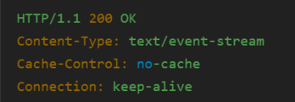
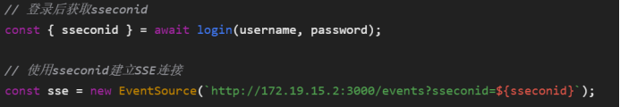
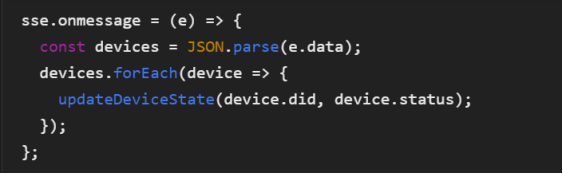

#### 1.1 获取全部设备状态api

l 请求路径

http://172.19.15.2:3000/devices/status

（建议与文档2中设备列表API的域名/端口保持一致）

l 请求方式

GET

l 请求头

Authorization: Bearer <JWT_TOKEN>

（通过JWT中的payload自动解析user_id，无需额外参数

结果格式：
{

  "code": 200,

  "data": {

    "devices": [

    {

    "did": "dev_123",

    "name": "小米空调",

    "type": "mi_ac",

    "brand": "Xiaomi",

    "online": true,

    "status": {

    "power": "ON",

    "target_temperature": 26,

    "mode": "cool",

    "fan_speed": "medium"

    }

    },

    {

    "did": "dev_456",

    "name": "青萍空气检测仪",

    "type": "mi_air_sensor",

    "brand": "Xiaomi",

    "online": true,

    "status": {

    "pm25": 35,

    "temperature": 28.5,

    "humidity": 60,

    "time": "2023-07-20T14:30:00Z"

    }

    }

    ]

  }

}

(作为演示，这里只列出两个设备，实际设备数更多)
错误码(获取全部设备状态)

- 401 认证失败，token无效或过期
- 500 服务器内部错误

**Sse连接api说明**

**建立服务器推送（SSE）长连接，用于向客户端实时推送设备状态变更（如温湿度传感器数据、设备开关状态等）。**

**请求路径：GET /events**

**请求头：无要求**

**请求参数：sseconid**

 **响应头：** **错误码403，** **sseconid无效** **500服务器内部错误**

#### 客户端主动退出接口

l 路径：POST /api/sse/exit

l 功能描述

用户主动通知服务端终止SSE连接，触发服务端清理以下资源：

取消该用户所有设备的第三方订阅（如美的/小米API）

关闭SSE长连接

移除内存中的连接记录

l 请求参数：sseconid（就是userid）

l 响应码：204退出成功，404连接不存在或者已经关闭

这里取消设备订阅就是调用第三方的取消设备订阅接口，取消该用户的所有设备订阅

客户端行为说明：

### 1 客户端

登录后需要存储sseconid

初始化先拉取全部设备状态，存储在内存，建立和服务端的sse连接

获得推送时，改变前面内存里面的状态

退出程序或者退出登录时，调用退出api

#### 1.1 新建分组api

客户端只传入分组的名字，服务端需要为它生成gid，并且返回gid和gname

请求路径: http://172.19.15.2:3000/devices/createGroup

请求方式: POST

请求头:

  Authorization: Bearer <JWT_TOKEN>

  Content-Type: application/json

请求体:

{

  "gname": "卧室设备" // 分组名称(必填)

}

成功响应(200):

{

  "code": 200,

  "message": "分组创建成功",

  "data": {

    gid：123

    "gname": "卧室设备",

  }

}

错误响应:

- 401 Unauthorized (JWT无效/过期)
- 400 Bad Request (分组名称为空或已存在)
- 409 Conflict (分组数量达到上限，建议限制每个用户最多5个分组)

#### 1.2 设置设备分组api

请求路径: http://172.19.15.2:3000/devices/setGroup

请求方式: POST

请求头:

  Authorization: Bearer <JWT_TOKEN>

  Content-Type: application/json

请求体:

{

  "device_id": "设备ID字符串",

  "group_id": "分组ID字符串" // 传null表示移除分组

}

成功响应(200):

{

  "code": 200,

  "message": "分组设置成功",

  "data": {

    "device_id": "设备ID",

    "group_id": "新分组ID"

  }

}

错误响应:

- 401 Unauthorized (JWT无效/过期)
- 404 Not Found (设备不存在/分组不存在)
- 400 Bad Request (参数错误)

#### 2.3 删除分组api

请求路径: http://172.19.15.2:3000/devices/deleteGroup

请求方式: POST

请求头:

  Authorization: Bearer <JWT_TOKEN>

  Content-Type: application/json

请求体:

{

  "gid": "分组ID"

}

成功响应(200):

{

  "code": 200,

  "message": "分组删除成功",

  "data": {

    "affected_devices": 3 // 该分组下的设备数量

  }

}

- 404 Not Found (分组不存在)

#### 2.4 获取用户当前分组信息api

请求路径: http://172.19.15.2:3000/devices/groups

请求方式: GET

请求头:

  Authorization: Bearer <JWT_TOKEN>

成功响应(200):

{

  "code": 200,

  "data": [

    {

    "gid": "123",

    "gname": "卧室设备",

    "device_count": 3,

    },

    {

    "gid": "456",

    "gname": "厨房设备",

    "device_count": 2,

    }

  ]

}
（作为演示，这里只列出几组）

- 401 Unauthorized (JWT无效/过期)
