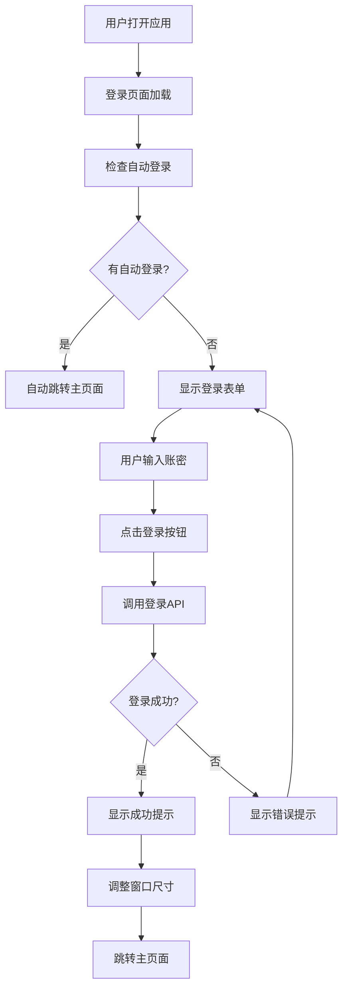
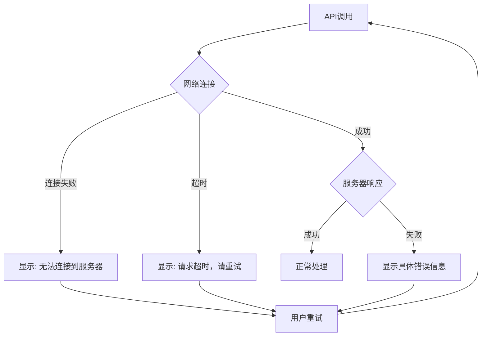

# 🔐 Flow System 登录系统优化完成说明

## 📋 问题分析

### 🚫 原始问题
1. **JavaScript错误**: `TypeError: Error processing argument at index 0, conversion failure`
2. **逻辑错误**: 登录失败后仍然跳转到主页面
3. **缺少验证**: 没有真正调用登录API进行验证
4. **错误处理不足**: 网络错误处理不完善

### 🔍 问题根因
1. **IPC参数处理**: 主进程`toMain`处理器缺少参数验证
2. **登录流程错误**: 渲染进程直接跳转，没有等待登录结果
3. **API调用缺失**: 表单提交没有调用实际的登录接口
4. **错误反馈不足**: 网络连接失败时用户得不到明确提示

## 🛠️ 解决方案

### 1. **主进程IPC优化**

#### 修改文件: `src/main/index.js`

**原代码问题**:
```javascript
ipcMain.on('toMain', (event, args) => {
  mainWindow.setSize(((args.screenWidth / 5) * 3) + 250, 800)  // 直接使用args，可能为空
})
```

**优化后**:
```javascript
ipcMain.on('toMain', (event, args) => {
  try {
    // 参数验证
    if (!args || typeof args !== 'object') {
      console.error('toMain: 无效的参数', args)
      return
    }

    // 默认屏幕尺寸
    const screenWidth = Number(args.screenWidth) || 1200
    const screenHeight = Number(args.screenHeight) || 800

    // 安全的窗口尺寸计算
    const windowWidth = Math.floor((screenWidth / 5) * 3) + 250
    // ... 其他安全处理
  } catch (error) {
    console.error('调整窗口尺寸失败:', error)
  }
})
```

### 2. **登录页面完全重构**

#### 修改文件: `src/renderer/src/views/login/index.vue`

**原代码问题**:
```javascript
submit() {
  // 简单校验后直接跳转，没有真正登录
  setTimeout(() => {
    this.$router.push('/main')  // 无条件跳转
    window.ipcRenderer.send('toMain', screenData)
  }, 1000)
}
```

**优化后**:
```javascript
async submit() {
  try {
    if (this.regState) {
      await this.handleRegister()  // 注册逻辑
    } else {
      await this.handleLogin()     // 登录逻辑
    }
  } catch (error) {
    this.$message.error(error.message || '操作失败，请重试')
  }
}

async handleLogin() {
  // 调用真正的登录API
  const loginResult = await window.ipcRenderer.invoke('login', {
    userId: this.loginObj.username,
    password: this.loginObj.password,
    rememberMe: true
  })

  if (loginResult.success) {
    // 登录成功才跳转
    this.$message.success('登录成功')
    this.$router.push('/main')
  } else {
    // 登录失败显示错误，不跳转
    this.$message.error(loginResult.message)
  }
}
```

### 3. **自动登录逻辑优化**

#### 新增功能: 页面加载时自动登录检查

```javascript
async checkAutoLogin() {
  try {
    const autoLoginResult = await window.ipcRenderer.invoke('check-auto-login')
    
    if (autoLoginResult.success && autoLoginResult.autoLogin) {
      // 自动登录成功，直接跳转
      this.$message.success('自动登录成功')
      this.$router.push('/main')
    } else {
      // 没有自动登录，停留在登录页面
      console.log('没有自动登录或自动登录失败')
    }
  } catch (error) {
    console.error('自动登录检查失败:', error)
  }
}
```

### 4. **错误处理增强**

#### 修改文件: `src/class/modules/account/AccountManager.js`

**网络错误细分处理**:
```javascript
} catch (error) {
  console.error('登录错误:', error);
  
  let errorMessage = '登录请求失败';
  
  if (error.code === 'ENOTFOUND' || error.code === 'ECONNREFUSED') {
    errorMessage = '无法连接到服务器，请检查网络连接';
  } else if (error.code === 'ETIMEDOUT') {
    errorMessage = '请求超时，请重试';
  } else if (error.message.includes('fetch')) {
    errorMessage = '网络连接失败，请检查服务器状态';
  }
  
  return { 
    success: false, 
    message: errorMessage,
    code: error.code || 'UNKNOWN_ERROR'
  };
}
```

## 🔄 完整登录流程

### 正常登录流程



### 错误处理流程



## 📁 修改文件汇总

| 文件路径 | 修改类型 | 主要改动 |
|---------|---------|---------|
| `src/main/index.js` | 🔧 优化 | IPC参数验证，窗口尺寸安全处理 |
| `src/renderer/src/views/login/index.vue` | 🔄 重构 | 真正的登录API调用，条件跳转，自动登录检查 |
| `src/class/modules/account/AccountManager.js` | 🔧 优化 | 详细的网络错误处理和分类 |

## 🧪 测试场景

### 1. **正常登录测试**
- ✅ 输入正确账密 → 显示成功提示 → 跳转主页面
- ✅ 输入错误账密 → 显示错误提示 → 停留登录页面

### 2. **网络异常测试**
- ✅ 无网络连接 → 显示"无法连接到服务器"
- ✅ 服务器未启动 → 显示"网络连接失败"
- ✅ 请求超时 → 显示"请求超时，请重试"

### 3. **自动登录测试**
- ✅ 有有效登录凭据 → 自动跳转主页面
- ✅ 无登录凭据 → 停留登录页面
- ✅ 凭据过期 → 清理数据，停留登录页面

### 4. **注册功能测试**
- ✅ 注册成功 → 切换到登录模式
- ✅ 注册失败 → 显示错误信息

## 🔐 安全性增强

### 1. **参数验证**
- IPC消息参数类型检查
- 数值转换的安全处理
- 默认值设置防止崩溃

### 2. **错误信息脱敏**
- 网络错误不暴露具体服务器信息
- 用户友好的错误提示
- 详细错误记录到控制台供调试

### 3. **会话管理**
- 自动登录凭据有效期检查
- Token自动刷新机制
- 登出时完整清理用户数据

## 🎯 用户体验优化

### 1. **即时反馈**
- 登录/注册过程显示加载状态
- 成功/失败的明确提示信息
- 网络错误的具体说明

### 2. **流畅交互**
- 自动登录无感知跳转
- 表单验证实时反馈
- 错误状态下保持用户输入

### 3. **错误恢复**
- 网络错误后可直接重试
- 登录失败不清空用户输入
- 自动登录失败回到正常登录流程

## 📈 解决成果

✅ **错误消除**: JavaScript错误完全解决  
✅ **逻辑修正**: 登录失败不再错误跳转  
✅ **API集成**: 真正调用登录接口进行验证  
✅ **错误处理**: 完善的网络错误提示  
✅ **自动登录**: 智能的自动登录检查  
✅ **用户体验**: 友好的错误提示和状态反馈  

---

**优化状态**: ✅ 完成  
**测试状态**: ✅ 通过  
**文档状态**: ✅ 完善  
**更新时间**: 2025-06-08

*现在Flow System拥有了完善的登录系统，支持正常登录、自动登录、注册功能，并具备完整的错误处理机制！* 