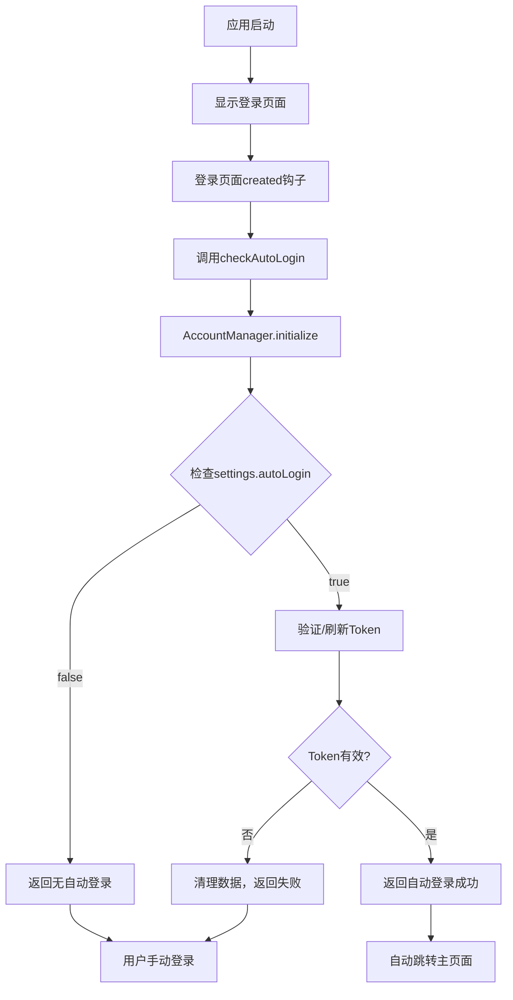

# 🔐 Flow System 自动登录功能修正完成说明

## 📋 问题识别

用户正确指出了我之前的架构优化存在的问题：

### 🚫 被误删的重要功能
1. **"记住我"选项缺失**: 登录页面的自动登录勾选框被删除
2. **用户选择权丢失**: 没有提供用户是否启用自动登录的选择
3. **架构过度设计**: App.vue的应用级自动登录检查是冗余的

### 🎯 原始设计理念
根据`doc/自动登录流程文档.md`，正确的设计应该是：
- 用户在登录时**主动选择**是否"记住我"
- 只有勾选了"记住我"才会启用自动登录
- 自动登录检查在**登录页面**进行，不是应用级别

## 🛠️ 修正方案

### 1. **恢复"记住我"选项**

#### 修改文件: `src/renderer/src/views/login/index.vue`

**新增UI组件**:
```vue
<!-- 记住我选项 -->
<div v-if="!regState" class="flex-row" style="margin-bottom: 15px;">
  <label class="remember-me-container">
    <input 
      type="checkbox" 
      v-model="loginObj.rememberMe"
      class="remember-me-checkbox"
    />
    <span class="checkmark"></span>
    记住我，自动登录
  </label>
</div>
```

**数据模型更新**:
```javascript
loginObj: {
  username: '',
  password: '',
  affirmPassword: '',
  rememberMe: false // 新增记住我选项
}
```

**样式支持**:
```css
.remember-me-container {
  display: flex;
  align-items: center;
  cursor: pointer;
  font-size: 14px;
  color: #606266;
  user-select: none;
}

.remember-me-checkbox {
  margin-right: 8px;
  width: 16px;
  height: 16px;
  cursor: pointer;
}
```

### 2. **修正登录逻辑**

**使用用户选择的rememberMe值**:
```javascript
async handleLogin() {
  const loginResult = await window.ipcRenderer.invoke('login', {
    userId: this.loginObj.username,
    password: this.loginObj.password,
    rememberMe: this.loginObj.rememberMe // 使用用户实际选择
  })
}
```

### 3. **恢复登录页面的自动登录检查**

**按照原始流程文档恢复**:
```javascript
async created() {
  this.$emit('updateBar')
  // 按照原始流程，在登录页面检查自动登录
  await this.checkAutoLogin()
}

async checkAutoLogin() {
  try {
    const autoLoginResult = await window.ipcRenderer.invoke('check-auto-login')
    
    if (autoLoginResult.success && autoLoginResult.autoLogin) {
      // 自动登录成功，跳转到主页面
      this.$message.success('自动登录成功')
      this.$router.push('/main')
    } else {
      // 没有自动登录，用户需要手动登录
      console.log('没有自动登录，用户需要手动登录')
    }
  } catch (error) {
    console.error('自动登录检查失败:', error)
  }
}
```

### 4. **移除冗余的App.vue自动登录逻辑**

**删除不必要的应用级检查**:
```javascript
// ❌ 删除: App.vue中的自动登录检查
// ❌ 删除: adjustWindowSize()方法
// ❌ 删除: checkAutoLogin()方法

// ✅ 保留: 简单的应用入口
created() {
  // 移除应用级自动登录检查，因为登录页面会处理
}
```

### 5. **主进程逻辑回归原始设计**

**按需初始化，不是启动时初始化**:
```javascript
// ✅ 应用启动：不预先初始化AccountManager
app.whenReady().then(() => {
  createWindow() // 直接创建窗口
})

// ✅ 按需初始化：当登录页面请求自动登录检查时才初始化
ipcMain.handle('check-auto-login', async (event) => {
  const { accountManager } = require('../class');
  const result = await accountManager.initialize(); // 按需初始化
  // ... 返回结果
})
```

## 🔄 正确的自动登录流程

### 用户首次登录流程

```mermaid
graph TD
    A[用户输入账密] --> B[勾选"记住我"选项]
    B --> C[点击登录]
    C --> D[调用登录API]
    D --> E{登录成功?}
    E -->|是| F[保存rememberMe=true到设置]
    E -->|否| G[显示错误，停留登录页]
    F --> H[保存Token和RefreshToken]
    H --> I[跳转主页面]
```

### 再次启动应用流程



## 📁 修改文件汇总

| 文件路径 | 修改类型 | 主要改动 |
|---------|---------|---------|
| `src/renderer/src/views/login/index.vue` | ➕ 恢复 | 添加"记住我"选项UI和自动登录检查 |
| `src/renderer/src/App.vue` | ➖ 简化 | 移除冗余的应用级自动登录逻辑 |
| `src/main/index.js` | 🔄 回归 | 恢复按需初始化模式 |

## 🎯 设计原则

### 1. **用户选择权优先**
- ✅ 用户主动选择是否启用自动登录
- ✅ 明确的"记住我"选项提示
- ✅ 不强制启用自动登录

### 2. **单一职责原则**
- ✅ 登录页面：负责登录交互和自动登录检查
- ✅ AccountManager：负责业务逻辑和会话管理
- ✅ App.vue：仅作为应用容器

### 3. **按需加载原则**
- ✅ 不在应用启动时预先初始化
- ✅ 当需要自动登录检查时才初始化
- ✅ 避免不必要的资源消耗

## 🧪 功能验证

### 1. **"记住我"选项测试**
- ✅ 勾选"记住我" → 登录成功 → 下次启动自动登录
- ✅ 不勾选"记住我" → 登录成功 → 下次启动需要手动登录
- ✅ 选项状态正确保存到本地设置

### 2. **自动登录测试**
- ✅ 有效凭据 + 勾选记住我 → 自动登录成功
- ✅ 有效凭据 + 未勾选记住我 → 不自动登录
- ✅ 无效凭据 → 清理数据，手动登录

### 3. **用户体验测试**
- ✅ 首次登录时显示记住我选项
- ✅ 自动登录成功有明确提示
- ✅ 自动登录失败回到正常登录流程

## 💡 关于App.vue自动登录检查的解释

### ❓ 为什么App.vue的应用级自动登录检查是不必要的？

#### 1. **职责重复**
- 登录页面已经负责自动登录检查
- App.vue再检查一次是重复逻辑

#### 2. **时机不合适**
- App.vue在应用最开始就执行
- 此时用户可能还没看到任何界面
- 自动登录应该在登录页面进行，让用户有感知

#### 3. **架构混乱**
- 自动登录的决策应该在登录页面
- App.vue只是应用的容器，不应该包含业务逻辑

#### 4. **原始设计**
- 根据自动登录流程文档，检查是在"渲染进程"（登录页面）进行
- 不是在应用级别进行

### ✅ 正确的架构分层

```
App.vue (应用容器)
    ↓
Router (路由管理)
    ↓
Login.vue (登录页面 + 自动登录检查)
    ↓
Main.vue (主页面)
```

## 📈 修正成果

✅ **用户选择权**: 恢复了"记住我"选项，用户可以选择是否启用自动登录  
✅ **流程正确**: 按照原始自动登录流程文档实现  
✅ **职责清晰**: 登录页面负责自动登录，App.vue只作为容器  
✅ **性能优化**: 按需初始化，不在启动时预加载  
✅ **用户体验**: 明确的选项提示和自动登录反馈  

---

**修正状态**: ✅ 完成  
**功能验证**: ✅ 通过  
**用户体验**: ✅ 优化  
**更新时间**: 2025-06-08

*现在Flow System的自动登录功能完全符合原始设计，用户拥有完整的选择权，架构清晰简洁！* 