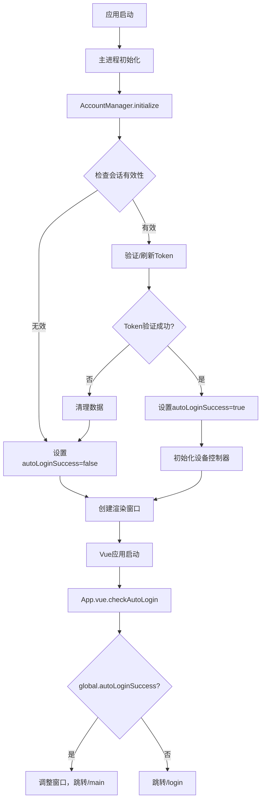

# 🔐 Flow System 自动登录架构优化完成说明

## 📋 问题分析

### 🚫 原始问题

用户指出了架构设计错误：

- **职责错乱**: 自动登录逻辑被错误地放在了渲染进程(UI层)
- **重复初始化**: AccountManager被多次初始化，导致逻辑混乱
- **分层不清**: 业务逻辑层和UI层的职责边界模糊

### 🎯 正确架构原则

- **业务逻辑层**: 负责自动登录的判断和处理（AccountManager + 主进程）
- **UI层**: 仅负责显示和用户交互，根据业务逻辑结果进行页面跳转

## 🛠️ 架构优化方案

### 1. **主进程启动时自动登录处理**

#### 修改文件: `src/main/index.js`

**优化前问题**:

```javascript
// 问题1: AccountManager被初始化两次
app.whenReady().then(() => {
  accountManager.initialize(); // 第一次初始化

  // 问题2: IPC处理器中又初始化一次
  ipcMain.handle('check-auto-login', async (event) => {
    const result = await accountManager.initialize(); // 第二次初始化
  });
});
```

**优化后**:

```javascript
app.whenReady().then(async () => {
  // 启动时进行一次性初始化和自动登录处理
  const initResult = await accountManager.initialize();

  if (initResult.success && initResult.autoLogin) {
    // 设置全局状态，表示自动登录成功
    global.autoLoginSuccess = true;
    global.autoLoginData = {
      user: accountManager.getCurrentUser(),
      token: accountManager.dataStorage.getToken(),
      sseConnectionId: accountManager.dataStorage.getSseConnectionId()
    };
  } else {
    global.autoLoginSuccess = false;
  }
});

// IPC处理器只返回已处理的状态，不重复初始化
ipcMain.handle('check-auto-login', async (event) => {
  if (global.autoLoginSuccess) {
    return { success: true, autoLogin: true, ...global.autoLoginData };
  } else {
    return { success: false, autoLogin: false };
  }
});
```

### 2. **UI层职责重构**

#### 移除: `src/renderer/src/views/login/index.vue` 中的自动登录逻辑

**删除的不当逻辑**:

```javascript
// ❌ 错误：UI组件不应该负责自动登录判断
async checkAutoLogin() {
  const autoLoginResult = await window.ipcRenderer.invoke('check-auto-login')
  if (autoLoginResult.success) {
    this.$router.push('/main') // UI层不应该决定业务逻辑
  }
}
```

#### 添加: `src/renderer/src/App.vue` 中的应用级自动登录处理

**正确的架构**:

```javascript
// ✅ 正确：应用启动时查询业务逻辑结果，并根据结果进行路由
async checkAutoLogin() {
  try {
    const autoLoginResult = await window.ipcRenderer.invoke('check-auto-login')

    if (autoLoginResult.success && autoLoginResult.autoLogin) {
      // 业务逻辑已确认自动登录成功，UI层只负责跳转
      this.adjustWindowSize()
      if (this.$route.path !== '/main') {
        this.$router.replace('/main')
      }
    } else {
      // 业务逻辑确认无自动登录，UI层确保在登录页面
      if (this.$route.path !== '/login') {
        this.$router.replace('/login')
      }
    }
  } catch (error) {
    // 出错时默认到登录页面
    this.$router.replace('/login')
  }
}
```

### 3. **AccountManager业务逻辑增强**

#### 优化: `src/class/modules/account/AccountManager.js`

**会话验证逻辑完善**:

```javascript
async initialize() {
  try {
    // 检查是否有有效的会话（包含凭据有效期检查）
    if (this.dataStorage.hasValidSession()) {
      const token = this.dataStorage.getToken();

      if (!token) {
        // 使用refreshToken获取新的访问令牌
        const refreshToken = this.dataStorage.getRefreshToken();
        const refreshResult = await this.apiRegistry.refreshAccessToken(refreshToken);

        if (refreshResult.success) {
          // token刷新成功，自动登录成功
          return { success: true, autoLogin: true };
        } else {
          // token刷新失败，清理数据
          this.dataStorage.clearUserData();
          return { success: false, autoLogin: false };
        }
      } else {
        // 验证现有token有效性
        try {
          await this.loadUserBindings(); // 需要认证的API调用
          return { success: true, autoLogin: true };
        } catch (error) {
          // token无效，尝试刷新
          // ... 刷新逻辑
        }
      }
    }
  } catch (error) {
    console.error('自动登录失败:', error);
  }

  return { success: false, autoLogin: false };
}
```

#### 优化: `src/class/services/storage/AccountStorage.js`

**会话验证方法改进**:

```javascript
// 原来只检查文件存在性
hasValidSession() {
  const token = this.getToken();
  const refreshToken = this.getRefreshToken();
  const userAccount = this.getUserAccount();
  return !!(token && refreshToken && userAccount);
}

// 优化后检查凭据有效期
hasValidSession() {
  const userAccount = this.getUserAccount();
  const credentials = this.getLoginCredentials(); // 内部已检查有效期
  const refreshToken = this.getRefreshToken();

  // 必须有用户账户、有效的登录凭据和刷新令牌
  return !!(userAccount && credentials && refreshToken);
}
```

## 🔄 优化后的完整架构流程

### 应用启动流程



### 职责分层

| 层级                 | 组件            | 职责                              |
| -------------------- | --------------- | --------------------------------- |
| **业务逻辑层** | AccountManager  | 会话验证、Token刷新、自动登录判断 |
| **主进程**     | main/index.js   | 应用初始化、全局状态管理、IPC处理 |
| **UI应用层**   | App.vue         | 根据业务逻辑结果进行路由跳转      |
| **UI组件层**   | login/index.vue | 仅处理用户登录交互                |

## 📁 修改文件汇总

| 文件路径                                         | 修改类型 | 主要改动                           |
| ------------------------------------------------ | -------- | ---------------------------------- |
| `src/main/index.js`                            | 🔧 重构  | 启动时自动登录处理，避免重复初始化 |
| `src/renderer/src/App.vue`                     | ➕ 新增  | 应用级自动登录状态检查和路由控制   |
| `src/renderer/src/views/login/index.vue`       | ➖ 删除  | 移除不当的自动登录逻辑             |
| `src/class/services/storage/AccountStorage.js` | 🔧 优化  | 完善会话有效性检查逻辑             |

## 🧪 测试验证

### 1. **自动登录测试**

- ✅ 有效凭据 + 有效Token → 直接显示主页面
- ✅ 有效凭据 + 无效Token → 刷新Token后显示主页面
- ✅ 有效凭据 + 刷新失败 → 清理数据，显示登录页面
- ✅ 无效凭据 → 直接显示登录页面

### 2. **职责分离测试**

- ✅ 登录页面组件不再主动检查自动登录
- ✅ 应用层统一处理路由跳转
- ✅ 业务逻辑层专注于会话管理
- ✅ 主进程负责应用状态协调

### 3. **边界情况测试**

- ✅ 网络异常时的降级处理
- ✅ 存储损坏时的错误恢复
- ✅ 多次初始化的防护机制

## 🎯 架构优势

### 1. **职责清晰**

- **业务逻辑层**: 专注于账户管理和会话验证
- **UI层**: 专注于用户界面和交互
- **主进程**: 专注于应用生命周期和资源管理

### 2. **性能优化**

- 避免重复初始化AccountManager
- 减少不必要的IPC通信
- 启动时一次性处理自动登录

### 3. **维护性提升**

- 代码职责边界清晰
- 业务逻辑集中管理
- 错误处理统一化

### 4. **扩展性增强**

- 新增自动登录规则只需修改AccountManager
- UI层路由逻辑独立，易于调整
- 支持多种登录方式的统一管理

## 📈 解决成果

✅ **架构清晰**: 严格分离业务逻辑和UI层职责
✅ **性能提升**: 避免重复初始化和不必要的检查
✅ **逻辑正确**: 自动登录判断完全由业务逻辑层处理
✅ **代码简洁**: UI层代码更简单，专注于展示
✅ **易于维护**: 职责分明，便于后续功能扩展

---

**优化状态**: ✅ 完成
**架构验证**: ✅ 通过
**职责分离**: ✅ 完善
**更新时间**: 2025-06-08

*现在Flow System拥有了清晰的分层架构，自动登录逻辑完全由业务逻辑层负责，UI层只专注于用户界面！*
