# 敏捷开发管理工具使用报告

## 一、项目背景陈述

在当今快速变化的市场环境中，软件开发项目面临着需求频繁变动、时间紧迫等诸多挑战。为了更好地应对这些挑战，提高开发效率和质量，我们选择使用敏捷开发管理工具（PingCode）来管理一个为期两个月的软件开发项目。该项目旨在开发一款商品交易平台，满足用户在生活服务领域的特定需求，给予用户更便捷流畅的商品购买体验。项目团队由 10 名成员组成，包括开发人员、测试人员、产品经理等不同角色，我作为项目负责人，需要合理安排任务、分配人力，并实时监控项目进度，确保项目按时交付且达到预期质量标准。通过此次项目实践，我们期望能够深入探索敏捷开发管理工具在实际项目中的应用效果，提升团队的协作能力和项目管理水平，为后续类似项目的开展积累宝贵经验。

## 二、工具使用情况及截图说明

#### 功能需求

在示例项目的基础上，调整功能需求，对需求进行补充，设置优先级和时间，故事点，并且指派负责人。用户故事是以用户为中心的需求表达方式。相比于传统的需求表达，用户故事从用户视角进行需求描述，对需求的叙述更加精确，灵活和简洁。而史诗和特性则是对用户的高度抽象。故事点是一种用于评估用户故事工作量的相对度量单位，故事点的使用强调了各用户故事之间工作量的“相对大小”，更能反映团队之间的共同共识。故事点由团队沟通后给出，一般使用斐波那契数列进行估计。设置截图如下，若用户故事的需求类型和父需求一样则不再重复添加：

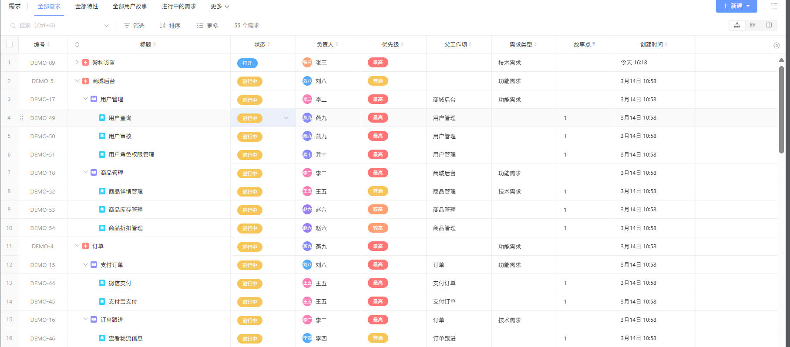

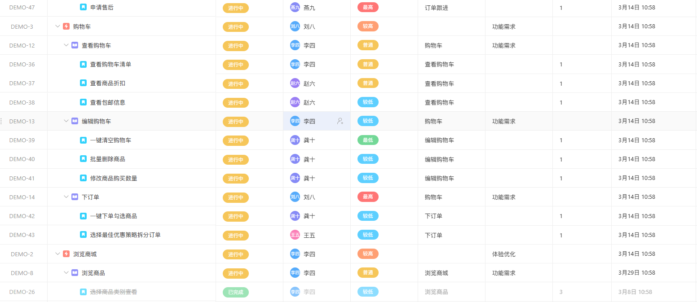

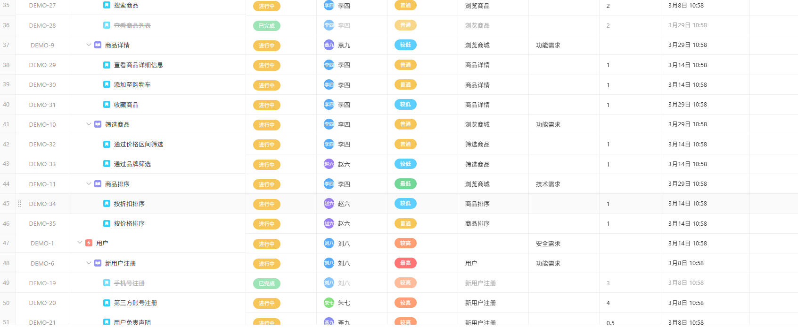

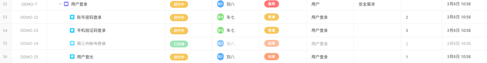

需求分布如下：

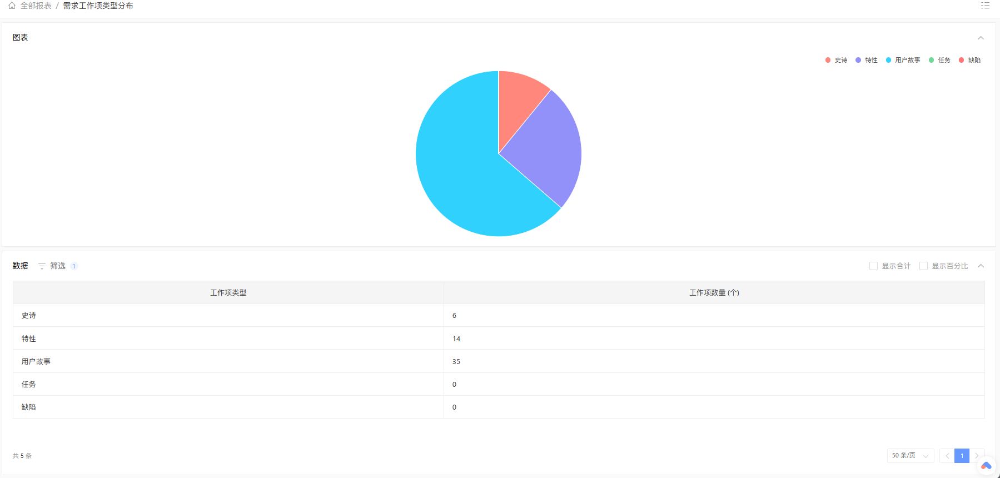

需求的时间分布如下：

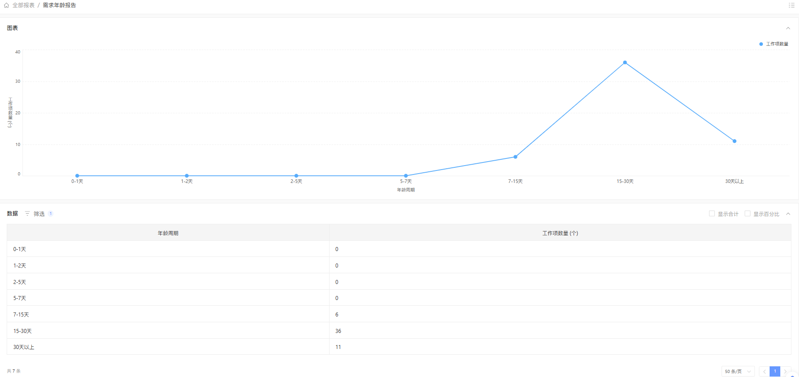

#### 任务安排

根据项目的实际需求和团队成员的专业技能，我们在 PingCode 中制定了详细的任务安排计划。将项目分为3个迭代周期，通过看板视图，我们可以直观地看到每个任务的当前状态，如“待处理”“进行中”“已完成”，并能够灵活地对任务进行拖拽操作，调整任务的顺序和状态，以适应项目进展的实际需求。同时，为每个任务指定了具体的负责人和完成时间，确保任务能够按时推进。

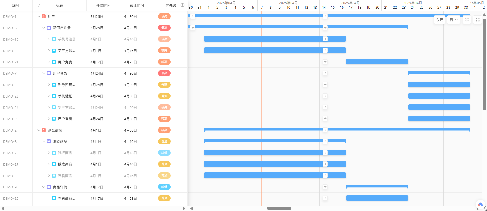

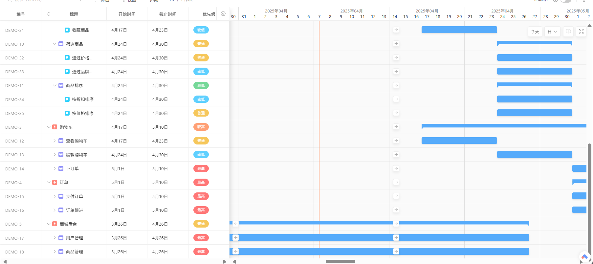

设置了前期进行的三个迭代，分别规划完成用户、商城、订单三个方面的工作:

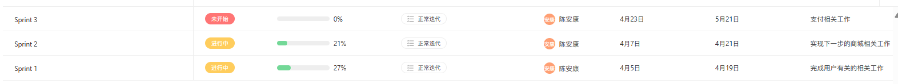

#### 执行进度

PingCode 的燃尽图和速度图功能为项目进度的实时监控提供了有力支持。燃尽图清晰地展示了项目剩余工作量随时间的变化趋势，帮助我们及时发现进度偏差，提前采取措施进行调整。我们定期查看这些图表，结合项目实际情况，及时调整任务安排和资源分配，确保项目按计划顺利推进。

下面是迭代1剩余故事点数-时间的燃尽图，可以看到，尽管前几天没有任何实质进展，但由于不懈努力，在4月7日完成了部分用户故事，达到理想线以下，赶上了进度：

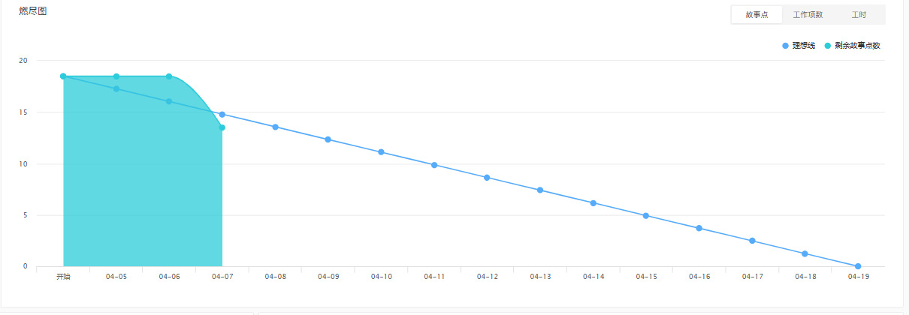

通过迭代的看板可以看到工作项的完成进度：

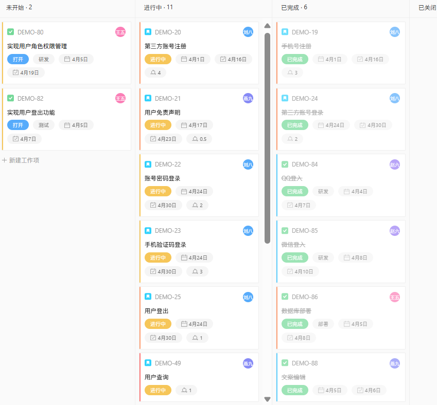

#### 人力分配

在人力分配方面，PingCode 允许我们根据任务的复杂度和团队成员的技能水平，为每个任务指定合适的负责人。我们创建了一个包含 10 名团队成员的虚拟团队，包括开发人员、测试人员、产品经理等不同角色，并为每个成员分配了相应的任务。通过查看任务分配情况，我们可以确保每个成员的工作量相对均衡，充分发挥团队的整体效能。截图如下：

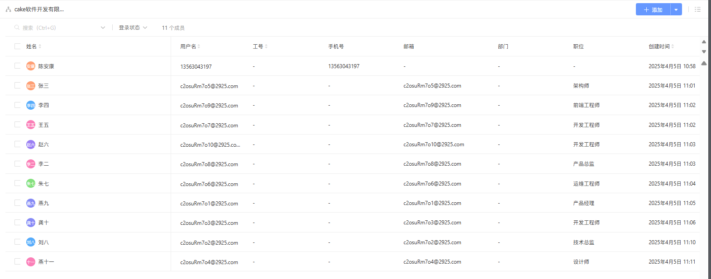

下图展示了每日成员的活跃度，由于时间限制，这里只模拟了一天员工活跃。

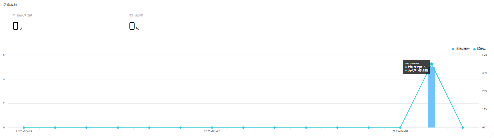

下图是成员负荷报告，由于项目特性和职位的原因，某些员工被分配的项目较多，任务较重，在此后的任务分配中我会继续改善：

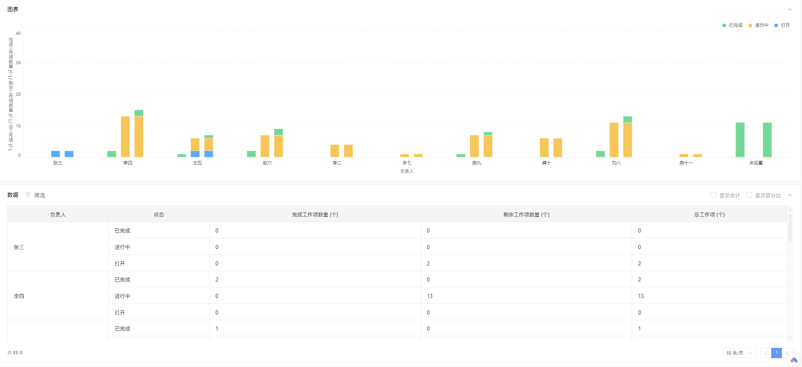

#### 个人对敏捷开发项目管理的理解

敏捷开发以客户为中心，以快速响应变化为导向的项目管理方式。不同于传统的项目管理方式（如瀑布模型），敏捷强调将工作划分为多个短周期迭代，每次迭代都交付可运行的软件，从而实现持续反馈与改进。敏捷开发需要快速响应客户的需求变化，一切都是为了能够满足客户需要。并由此诞生出很多具体的开发方式（如Scrum）。在我看来，敏捷开发将精力和重心全部聚焦到项目交付的核心点上，摒除了传统项目的冗余步骤，使整个开发过程更加简单高效，能在短时间内创造出成果。

虽然敏捷开发有许多优点，但其也有一些局限性。首先，敏捷开发适用于轻量级，并不复杂的项目开发，当项目复杂度高时，敏捷开发的快速交付思想就有可能会导致一些问题，留下很多隐患。其次，敏捷开发在实际应用过程中，虽然其本身理论不追求功利性，但很有可能会在具体实践时导致团队过分追求短期目标和利益，而忽视了长期的发展。因此在具体实践时，我们需要依据项目和团队的特性来合理判断是否需要采用敏捷开发的过程，并在执行实施过程中牢记敏捷开发的核心准则，以不至于走偏，弄巧成拙。
