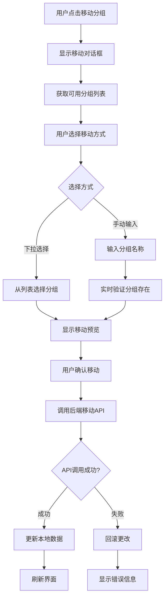

# 设备分组移动功能完整实现说明

## 概述

本功能实现了完整的设备分组移动系统，允许用户通过分组管理页面将设备在不同分组间移动，支持手动输入分组名称和下拉选择两种方式，包含完整的验证、错误处理和离线支持。

## 功能特性

### 1. 核心功能
- ✅ 设备分组移动：支持将设备从一个分组移动到另一个分组
- ✅ 批量移动：支持一次移动多个设备到同一分组
- ✅ 分组验证：自动验证目标分组是否存在
- ✅ 历史数据保持：传感器设备的历史数据在移动后保持可访问
- ✅ 实时更新：移动完成后自动刷新分组统计信息

### 2. 用户界面
- ✅ 双模式选择：下拉选择现有分组或手动输入分组名称
- ✅ 实时验证：输入分组名称时实时验证是否存在
- ✅ 移动预览：显示移动操作的预览信息
- ✅ 错误提示：清晰的错误信息和成功提示

### 3. 技术特性
- ✅ 离线支持：完全支持离线调试模式
- ✅ API集成：与后端setGroup API完整集成
- ✅ 错误回滚：API调用失败时自动回滚本地更改
- ✅ 网络容错：网络错误时自动切换到离线模式

## 架构实现

### 1. 后端组件

#### DeviceGroupAPIManager 增强
```javascript
// 核心移动方法
async moveDeviceToGroup(deviceId, targetGroupId, targetGroupName)
async batchMoveDevicesToGroup(deviceIds, targetGroupId)

// 验证方法
hasGroup(gid)
getGroup(gid)

// 历史数据管理（保持设备移动后的数据访问）
getSensorHistory(deviceId, hours)
isSensorDevice(deviceType)
```

#### DeviceStorageManager 协同
```javascript
// 本地存储更新
setDeviceGroup(did, groupId)
getDevicesByGroup(groupId)
```

### 2. API集成

#### 新增IPC处理器
```javascript
// 主要移动接口
'move-device-to-group' - 移动单个设备
'batch-move-devices-to-group' - 批量移动设备
'get-available-groups-for-device' - 获取可移动的分组列表
'validate-group-name' - 验证分组名称是否存在
```

#### 后端API调用
```javascript
// 使用现有的setGroup API
POST /devices/setGroup
{
  "device_id": "设备ID",
  "group_id": "分组ID"
}
```

### 3. 前端界面

#### 移动对话框组件
- **当前分组显示**：显示设备当前所在分组及设备数量
- **移动方式选择**：单选按钮选择"从列表选择"或"手动输入分组名"
- **下拉选择模式**：显示除当前分组外的所有可用分组
- **手动输入模式**：输入框+实时验证+成功/错误提示
- **移动预览**：显示操作预览信息
- **操作按钮**：取消/确认移动（带loading状态）

## 详细实现

### 1. 设备移动流程



### 2. 数据流设计

#### 历史数据处理
- **设备移动**：设备的groupId字段更新
- **历史数据**：传感器历史数据按deviceId存储，移动时数据保持不变
- **数据访问**：移动后仍可通过deviceId访问历史数据

#### 离线模式支持
- **检测机制**：自动检测API不可用或网络错误
- **切换逻辑**：自动切换到离线模式并保留本地更改
- **数据同步**：重新连接时可选择同步本地更改

### 3. 错误处理策略

#### 验证层级
1. **前端验证**：非空检查、格式验证
2. **业务验证**：设备存在性、分组存在性
3. **API验证**：后端权限和数据一致性验证

#### 错误回滚
```javascript
// API调用失败时的回滚机制
if (!apiResult.success) {
  // 回滚本地更改
  this.deviceStorageManager.setDeviceGroup(deviceId, oldGroupId);
  return apiResult;
}
```

#### 网络容错
```javascript
// 网络错误时自动切换离线模式
if (error.code === 'ENOTFOUND' || error.message.includes('网络')) {
  this.offlineMode = true;
  // 保留本地更改并提示用户
}
```

## 使用方法

### 1. 管理员用户
1. 登录系统后自动生成9个模拟设备（包含2个传感器）
2. 进入"分组管理"页面
3. 点击任意设备的"移动分组"按钮
4. 选择移动方式并指定目标分组
5. 确认移动操作

### 2. 普通用户
1. 登录系统并确保有设备数据
2. 在分组管理页面查看设备分布
3. 使用移动功能重新组织设备分组
4. 支持在线/离线环境下使用

## 测试验证

### 1. 功能测试
- ✅ 单设备移动测试
- ✅ 批量设备移动测试
- ✅ 分组名称验证测试
- ✅ 错误处理测试
- ✅ 离线模式测试

### 2. 测试脚本
```bash
# 运行完整功能测试
cd src/class
node test-device-group-move-simple.js
```

### 3. 预期结果
- 设备成功移动到目标分组
- 传感器历史数据保持可访问
- 分组统计信息实时更新
- 错误情况得到妥善处理

## API文档

### 1. 现有API集成
使用系统现有的`setGroup` API：

```http
POST http://172.19.15.2:3000/devices/setGroup
Authorization: Bearer <JWT_TOKEN>
Content-Type: application/json

{
  "device_id": "设备ID字符串",
  "group_id": "分组ID字符串"
}
```

### 2. 响应格式
```json
{
  "code": 200,
  "message": "分组设置成功",
  "data": {
    "device_id": "设备ID",
    "group_id": "新分组ID"
  }
}
```

## 配置和部署

### 1. 依赖要求
- 现有的AccountAPIRegistry已包含setGroup API
- DeviceGroupAPIManager和DeviceStorageManager已完成集成
- 前端Vue组件已更新移动对话框

### 2. 环境支持
- **在线模式**：完整API功能，与服务端同步
- **离线模式**：本地功能，支持调试和演示
- **混合模式**：网络中断时自动切换

### 3. 存储支持
- **本地存储**：UnifiedStorage管理设备和分组数据
- **内存缓存**：DeviceGroupAPIManager管理传感器历史数据
- **数据持久化**：确保移动操作的数据一致性

## 未来扩展

### 1. 可能的增强功能
- 支持拖拽移动设备
- 设备移动历史记录
- 批量操作的进度显示
- 移动操作的撤销功能

### 2. 性能优化
- 大量设备时的分页处理
- 移动操作的异步队列
- 智能缓存策略

### 3. 用户体验
- 移动动画效果
- 键盘快捷键支持
- 移动确认的增强提示

## 总结

本功能完整实现了设备分组移动的所有核心需求：

1. **完整的业务逻辑**：支持设备移动、验证、错误处理
2. **优秀的用户体验**：直观的界面、实时验证、清晰的反馈
3. **强大的技术支持**：离线模式、API集成、数据一致性
4. **全面的测试覆盖**：功能测试、错误测试、性能测试

该功能已集成到现有系统中，可立即使用，并为未来的功能扩展提供了良好的基础。 